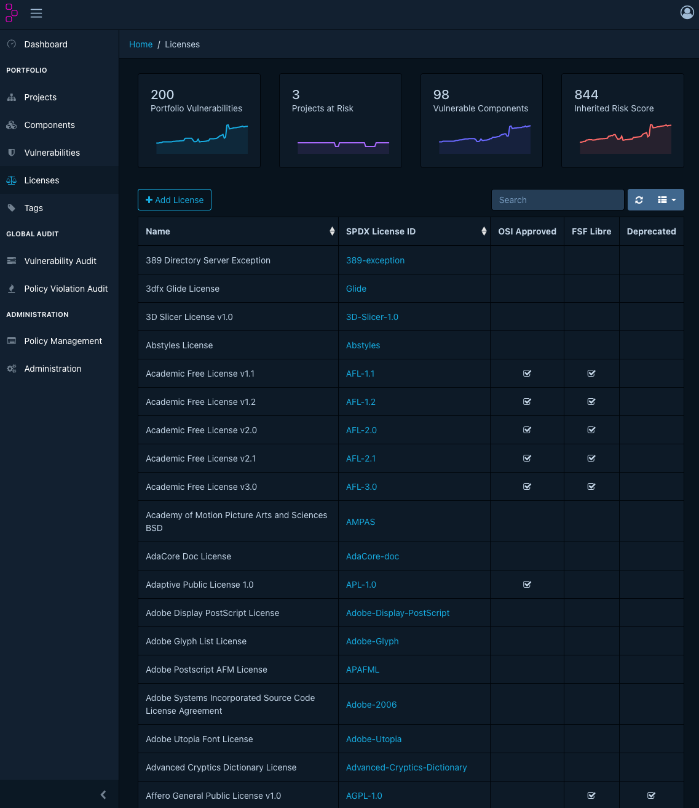
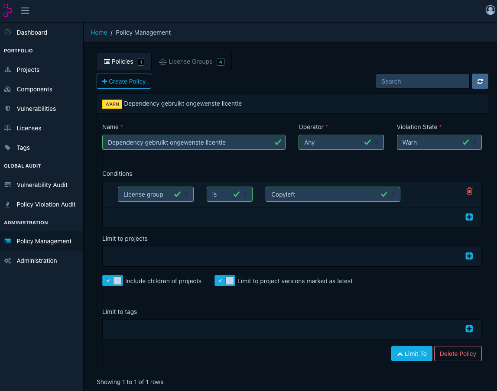

# Bekende problemen en oplossingen
## Probleem: de SBoM wordt eenmalig gescand
Na het uploaden van een [SBoM](#sbom) verschijnen er resultaten, maar een dag later lijken nieuwe kwetsbaarheden niet automatisch zichtbaar te worden. Het project lijkt daardoor alleen tijdens de eerste upload te zijn geanalyseerd.
De bedoeling van Dependency-Track is dat een SBoM wordt gemonitord en dus op dagelijkse basis wordt gescand. 
### Context
Dependency-Track is een tool die per project bewaakt welke externe softwarepakketten kwetsbaarheden bevatten.

Dependency-Track doet dit via achtergrondtaken. Daarbij zijn drie stappen belangrijk:

1. kwetsbaarheidsbronnen worden gesynchroniseerd (mirror) naar de lokale Dependency-Track-database;
2. componenten uit projecten worden geanalyseerd tegen die lokale kwetsbaarheidsdata;
3. metrics en dashboardwaarden worden bijgewerkt.
### Waarschijnlijke oorzaken
Mogelijke oorzaken zijn:
* De geplande 'portfolio vulnerability analysis' draait niet.
* De 'task scheduler' is uitgeschakeld of verkeerd geconfigureerd.
* De kwetsbaarheidsbronnen zijn niet ingeschakeld of nog niet gesynchroniseerd (mirror)
* de cronconfiguratie voor de portfolio vulnerability analysis is aangepast of foutief ingesteld;
* De gebruiker verwart de metrics-refresh of grafiekupdate met een vulnerability analysis.

### Oplossing
> [!WARNING]
> ⚠️ **Let op:** 
> De gesuggereerde oplossingen hieronder zijn alleen uit te voeren door systeembeheerders.

#### Controleer of de geplande analyse actief is.
Voor Dependency-Track v5 zijn met name deze instellingen relevant:

```text
dt.task-scheduler.enabled=true
dt.task.portfolio-analysis.cron=0 6 * * *
```
Bij container- of Kubernetes-deployments worden deze waarden meestal als environment variables gezet:

```text
DT_TASK_SCHEDULER_ENABLED=true
DT_TASK_PORTFOLIO_ANALYSIS_CRON=0 6 * * *
```
De standaardwaarde `0 6 * * *` betekent dat de portfolio vulnerability analysis dagelijks om 06:00 UTC draait.

#### Controleer de vulnerability sources
De beheerder moet controleren of de kwetsbaarheidsbronnen correct zijn ingericht. Ga in Dependency-Track naar:

```text
Administration > Vulnerability Sources
```

Controleer minimaal:
* NVD
* GitHub Advisories
* OSV


Na het inschakelen van een bron moet de eerste synchronisatie (mirror) uitgevoerd worden. Gebruik daarvoor, indien beschikbaar in de interface:

```text
Mirror now
```

Let daarbij op het type identifier dat per bron nodig is:

| Bron              | Belangrijke identifier |
| ----------------- | ---------------------- |
| NVD               | CPE                    |
| GitHub Advisories | PURL                   |
| OSV               | PURL                   |

Controleer, voor de zekerheid, ook de SBoM zelf. Voor open-source dependencies is een Package URL, kortweg PURL, meestal essentieel. Voorbeelden:

```text
pkg:maven/org.apache.commons/commons-lang3@3.14.0
pkg:npm/lodash@4.17.21
pkg:pypi/requests@2.32.3
```

Als de SBoM geen PURL of CPE bevat, kan Dependency-Track de component mogelijk wel tonen, maar kwetsbaarheden minder goed of helemaal niet relateren aan een kwetsbaarhedendatabase.

> [!WARNING]
> ⚠️ **Let op:** 
> Let ook op het verschil tussen analyse en metriek. Een grafiek of dashboardwaarde die wordt bijgewerkt, betekent niet automatisch dat de vulnerabilities opnieuw zijn geanalyseerd. Controleer (of laat een systeembeheerder controleren) daarom bij twijfel de Dependency-Track API-serverlogs en de timestamps van de analyse.

Dependency-Track gebruikt meerdere achtergrondtaken die los van elkaar kunnen worden uitgevoerd. Kwetsbaarheidsbronnen zoals NVD, GitHub Advisories en OSV worden periodiek gesynchroniseerd (mirror). Daarnaast draait er een 'portfolio vulnerability analysis' die componenten opnieuw vergelijkt met de beschikbare kwetsbaarheidsdata. Daarna worden metrics (grafieken- en dashboardwaardes) periodiek bijgewerkt.

Door de 'portfolio vulnerability analysis' kan een grafiek- of dashboardwaarde veranderen zonder dat er op dat moment een nieuwe SBoM is geüpload. Een grafiek toont meestal een metrics-snapshot: een vastgelegde stand van onder meer vulnerabilities, findings, suppressions, auditstatus en policy violations op een bepaald moment.

Controleer (of laat een systeembeheerder dit doen) bij twijfel daarom niet alleen de grafiek, maar ook:

- de timestamp van de laatste SBoM-import;
- de timestamp van de laatste vulnerability analysis;
- de configuratie van de task scheduler;
- de ingestelde vulnerability sources;
- of findings actief, inactive of suppressed zijn;
- de API-serverlogs wanneer je wilt vaststellen of een specifieke achtergrondtaak daadwerkelijk heeft gedraaid.

### Bronnen
* Dependency-Track v5, Task Scheduler:
  https://dependencytrack.github.io/docs/next/reference/configuration/task-scheduler/
* Dependency-Track v5, Vulnerability Sources:
  https://dependencytrack.github.io/docs/next/guides/administration/configuring-vulnerability-sources/
* Dependency-Track v5, Analyzers:
  https://dependencytrack.github.io/docs/next/reference/analyzers/

---

## Probleem: geen duidelijk inzicht in gebruikte licenties
Het projectteam wil inzichtelijk maken welke licenties worden gebruikt in dependencies, maar het overzicht is onvolledig, onduidelijk of niet geschikt voor besluitvorming.



### Context
Dependency-Track kan per component licentie-informatie registreren en toetsen. Die informatie komt meestal uit de SBoM. Als de SBoM geen of onvolledige licentiegegevens bevat, kan Dependency-Track deze informatie ook niet betrouwbaar tonen of beoordelen.

Licentie-inzicht bestaat uit twee verschillende vragen:

1. Welke licenties worden gebruikt in dit project?
2. Welke gebruikte licenties zijn toegestaan, ongewenst of onbekend?

De eerste vraag is inventariserend. De tweede vraag hoort thuis in beleid, bijvoorbeeld via component policies.

Softwareontwikkelprojecten kunnen onbedoeld softwarepakketten (dependencies) gebruiken met licenties die niet passen bij het beleid van de organisatie. Vooral [copyleftlicenties](https://nl.wikipedia.org/wiki/Copyleft) vragen aandacht. Copyleftlicenties verplichten onder bepaalde voorwaarden dat gewijzigde of afgeleide software onder dezelfde of vergelijkbare licentie beschikbaar wordt gesteld.

De meest risicovolle categorieën zijn:
- **sterke copyleftlicenties**, zoals GPL-2.0 en GPL-3.0;
- **netwerk-copyleftlicenties**, zoals AGPL-3.0, vooral relevant voor SaaS- en webapplicaties;
- **zwakke copyleftlicenties**, zoals LGPL, MPL en EPL, die meestal beperkter werken, maar nog steeds voorwaarden kunnen opleggen;
- **niet-open-source restrictieve licenties**, zoals proprietary, source-available, non-commercial en no-derivatives licenties.

In Dependency-Track is het mogelijk om deze licenties niet alleen te inventariseren, maar ook via licentiebeleid te classificeren als **toegestaan**, **review vereist** of **niet toegestaan**.

### Verkeerde verwachtingen bij de licenses-pagina
Een veelvoorkomende oorzaak is dat gebruikers verwachten dat onder `/licenses` is terug te vinden welke softwarepakketten ongewenste licenties bevatten. Dit is niet het geval. De licenses-pagina geeft een overzicht van alle licenties die bekend zijn bij deze instantie van Dependency-track, aangevuld met classificaties (de kolommen OSI approved, FSF Libre en Deprecated).

| Kolomnaam    | Betekenis                                                                                                                                                                                                                                        |
| ------------ | ------------------------------------------------------------------------------------------------------------------------------------------------------------------------------------------------------------------------------------------------ |
| OSI approved | OSI-goedgekeurde licenties voldoen aan de Open Source Definition, wat in hoofdlijnen betekent dat software vrij gebruikt, aangepast en gedeeld mag worden.                                                                                       |
| FSF Libre    | Geeft aan of de Free Software Foundation de licentie als vrije softwarelicentie beschouwt. “Libre” gaat hier over vrijheid, niet over gratis gebruik.                                                                                            |
| Deprecated   | Geeft aan of de SPDX identifier van de licentie verouderd is. Dit betekent niet dat de licentie zelf ongeldig is. Het betekent dat SPDX het gebruik van deze identifier afraadt, meestal omdat er een betere of explicietere identifier bestaat. |

### Oplossing: Verkrijgen van het gewenste inzicht
Om inzicht te krijgen in de gebruikte ongewenste licenties van een project moet er eerst een licentiebeleid ('policy') worden geconfigureerd. Dit wordt [uitgelegd in de officiële documentatie](https://docs.dependencytrack.org/usage/policy-compliance/). Dit kan worden gedaan op de pagina 'Policy Management'

De eenvoudige manier is om gebruik te maken van de bestaande classificaties (licence group) van Dependency-track. 
Bij een sterk juridisch belang of organisatorisch beleid wordt het aanbevolen om handmatig een license-group aan te maken en daarin op te nemen welke licenties niet acceptabel zijn.
#### Stap 1: Zelf configureren van een license group (optioneel)
Ga naar:

```text
Policy Management > License Groups
```

Maak bijvoorbeeld deze groepen aan:

| License group        | Doel                                                          |
| -------------------- | ------------------------------------------------------------- |
| Toegestane licenties | Licenties die binnen de organisatie standaard zijn toegestaan |
| Verboden licenties   | Licenties die niet gebruikt mogen worden                      |
| Review vereist       | Licenties die handmatige beoordeling vereisen                 |

#### Stap 2: Maak een policy aan
Maak vervolgens component policies aan via:

```text
Policy Management > Policies
```



Voorbeelden van bruikbare policies:
### Policy: verboden licenties blokkeren (ingebouwde license group )

```text
Name: Dependency gebruikt ongewenste licentie
Operator: Any
Violation state: Warn

Condition: License group is Copyleft
Limit to
Include children of projects: yes
Limit to project versions marked as latest: yes
```
### Belangrijke nuance: welke dependency moet vervangen worden?

Dependency-Track toont de **component die de policy overtreedt**. Dat is niet automatisch de dependency die je in `pom.xml`, `package.json`, `build.gradle` of een ander dependency-bestand moet vervangen.

Voorbeeld:

```text
jouw applicatie└── directe dependency A    └── transitieve dependency B met GPL-licentie
```

In dit geval is **B** de component met de ongewenste licentie. Maar de dependency die je waarschijnlijk moet vervangen of uitsluiten is **A**, omdat A de transitieve dependency B binnenhaalt.

Dependency-Track v5 heeft wel mogelijkheden om dependency-relaties te evalueren via policy expressions. De documentatie noemt functies zoals `is_dependency_of`, `is_direct_dependency_of` en `is_exclusive_dependency_of`. Daarmee kun je bepalen of een component direct, transitief of exclusief via een andere component wordt binnengehaald.


> [!INFO] Licenties van transitieve dependencies
> Dependency-Track kan alleen informatie verschaffen over WELKE softwarepakketten (dependencies) ongewenste licenties bevatten. Daarna moet het ontwikkelteam in de dependency tree van de gebruikte package manager bepalen welke directe dependency de transitieve component binnenhaalt.

## Probleem: licenties worden niet weergegeven
### Waarschijnlijke oorzaken
Mogelijke oorzaken zijn:

* De SBoM-generator neemt geen licentiegegevens op.
* Licenties worden niet als SPDX License Identifier vastgelegd.
* Sommige dependencies hebben geen eenduidige licentie.
* Er is geen licentiebeleid ingericht in Dependency-Track.
* Er zijn geen license groups of component policies geconfigureerd.
* Onbekende licenties worden niet apart bewaakt.

### Oplossing

Begin bij de bron: de SBoM moet licentie-informatie bevatten. 
Zorg dat de SBoM-generator deze informatie toevoegt aan de SBoM.
Gebruik waar mogelijk SPDX License Identifiers, bijvoorbeeld:

```text
MIT
Apache-2.0
BSD-3-Clause
GPL-3.0-only
LGPL-2.1-or-later
```

Gebruik bij samengestelde of alternatieve licenties een SPDX expression, bijvoorbeeld:

```text
MIT OR Apache-2.0
```


### Bronnen

* Dependency-Track v5, Managing Component Policies:
  https://dependencytrack.github.io/docs/next/guides/user/managing-component-policies/
* Dependency-Track v5, Component Policies Reference:
  https://dependencytrack.github.io/docs/next/reference/policies/component-policies/
* SPDX License List:
  https://spdx.org/licenses/

---

## Het SBoM-formaat wordt niet geaccepteerd

### Context

Dependency-Track v5 ondersteunt CycloneDX als uploadformaat voor SBoM’s. De ondersteunde serialisaties zijn:

| Formaat        | Content type                     |
| -------------- | -------------------------------- |
| CycloneDX JSON | `application/vnd.cyclonedx+json` |
| CycloneDX XML  | `application/vnd.cyclonedx+xml`  |

Dependency-Track v5 ondersteunt alle CycloneDX BOM specification versions voor upload.

### Probleem

Een SBoM wordt niet geaccepteerd door Dependency-Track, of de upload lukt wel maar de inhoud wordt niet goed verwerkt.

### Waarschijnlijke oorzaken

Mogelijke oorzaken zijn:

* De SBoM is geen CycloneDX-document.
* De SBoM is SPDX, Syft JSON, npm audit JSON of een ander formaat.
* De SBoM is CycloneDX, maar ongeldig volgens het CycloneDX-schema.
* De SBoM bevat syntactische fouten.
* De SBoM is geconverteerd, maar tijdens de conversie is informatie verloren gegaan.
* De SBoM bevat onvoldoende metadata, zoals PURL’s of licentiegegevens.

### Oplossing

Genereer bij voorkeur direct een CycloneDX-SBoM vanuit de build of dependency manager van het project. Gebruik dus liever een native CycloneDX-generator dan een conversiestap achteraf.

Voorbeelden van ecosystemen waarvoor CycloneDX-tools bestaan:

| Ecosysteem    | Aanpak                                       |
| ------------- | -------------------------------------------- |
| Maven         | CycloneDX Maven-plugin                       |
| Gradle        | CycloneDX Gradle-plugin                      |
| npm / Node.js | CycloneDX Node.js tooling                    |
| Python        | CycloneDX Python tooling                     |
| .NET          | CycloneDX .NET tooling                       |
| Containers    | Tooling die CycloneDX als output ondersteunt |

Valideer de SBoM voordat deze naar Dependency-Track wordt gestuurd.

Voor CycloneDX JSON:

```bash
cyclonedx validate \
  --input-file bom.json \
  --input-format json \
  --fail-on-errors
```

Voor CycloneDX XML:

```bash
cyclonedx validate \
  --input-file bom.xml \
  --input-format xml \
  --fail-on-errors
```

Gebruik conversie alleen als tijdelijke oplossing. Bijvoorbeeld wanneer een leverancier alleen SPDX JSON aanlevert.

Voorbeeld:

```bash
cyclonedx convert \
  --input-file SBoM.spdx.json \
  --input-format spdxjson \
  --output-file bom.json \
  --output-format json \
  --output-version v1_6
```

Valideer daarna altijd het resultaat:

```bash
cyclonedx validate \
  --input-file bom.json \
  --input-format json \
  --fail-on-errors
```

Let op: conversie tussen SBoM-formaten is niet altijd verliesvrij. Controleer na conversie minimaal:

* componentnaam
* versie
* package URL
* licentie
* supplier
* hashes
* dependency-relaties

### Praktisch advies

Gebruik voor Dependency-Track-projecten deze voorkeursvolgorde:

1. Genereer direct CycloneDX vanuit de build.
2. Valideer de CycloneDX-SBoM.
3. Upload de gevalideerde SBoM naar Dependency-Track.
4. Gebruik conversie alleen als fallback.
5. Controleer na conversie of kritieke metadata niet verloren is gegaan.

### Bronnen

* Dependency-Track v5, File Formats:
  https://dependencytrack.github.io/docs/next/reference/file-formats/
* CycloneDX Tool Center:
  https://cyclonedx.org/tool-center/
* CycloneDX CLI:
  https://github.com/CycloneDX/cyclonedx-cli

---

## VDR- en VEX-export uit Dependency-Track

### Context

Dependency-Track kan naast SBoM’s ook CycloneDX-documenten genereren met kwetsbaarheidsinformatie.

Belangrijke termen:

| Term | Betekenis                                 |
| ---- | ----------------------------------------- |
| BOM  | Bill of Materials, de componentinventaris |
| VEX  | Vulnerability Exploitability Exchange     |
| VDR  | Vulnerability Disclosure Report           |

### Toelichting

Een VEX-document beschrijft analysebeslissingen over kwetsbaarheden. Het geeft bijvoorbeeld context over de vraag of een kwetsbaarheid exploiteerbaar is in een specifieke toepassing.

Een VDR-document bevat kwetsbaarheidsinformatie over componenten in een product of project.

Noem een VDR daarom niet simpelweg een “annotated SBoM”. Dat is te onnauwkeurig. Een betere formulering is:

> Een Dependency-Track VDR-export is een CycloneDX Vulnerability Disclosure Report met kwetsbaarheidsinformatie over componenten in het project.

### Bronnen

* Dependency-Track v5, File Formats:
  https://dependencytrack.github.io/docs/next/reference/file-formats/
* CycloneDX, Vulnerability Disclosure Report:
  https://cyclonedx.org/use-cases/vulnerability-disclosure/
* CycloneDX, Vulnerability Exploitability Exchange:
  https://cyclonedx.org/capabilities/vex/

---

## “Refresh requested” bij grafieken of projectmetingen

### Context

Dependency-Track toont projectmetingen en grafieken, maar deze zijn niet hetzelfde als een vulnerability analysis.

### Probleem

Bij een project of grafiek staat dat een refresh is aangevraagd, maar het is niet duidelijk of dit betekent dat kwetsbaarheden opnieuw worden geanalyseerd.

### Uitleg

Behandel een metrics-refresh en een vulnerability analysis als twee verschillende processen.

Een metrics-refresh werkt projectmetingen of grafieken bij. Een vulnerability analysis beoordeelt componenten tegen kwetsbaarheidsbronnen.

Als nieuwe kwetsbaarheden niet zichtbaar worden, controleer dan niet alleen de grafiek of metrics, maar ook:

* of de portfolio vulnerability analysis draait;
* of de vulnerability sources recent zijn gespiegeld;
* of de SBoM bruikbare identifiers bevat;
* of de API-serverlogs analyseactiviteit tonen.

### Bronnen

* Dependency-Track v5, Task Scheduler:
  https://dependencytrack.github.io/docs/next/reference/configuration/task-scheduler/
