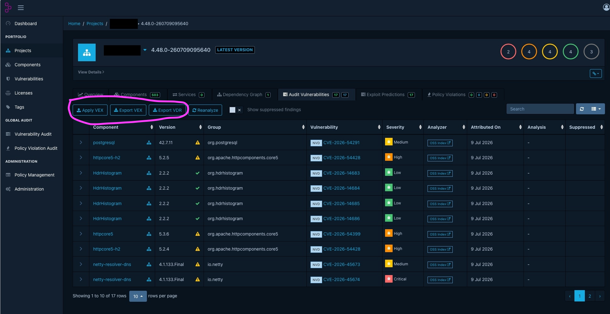

# VDR- en VEX-export uit Dependency-Track

## Context
Dependency-Track kan naast SBoM’s ook CycloneDX-documenten genereren met kwetsbaarheidsinformatie.

Belangrijke termen

| Term | Betekenis                                          | Meer uitleg   |
| ---- | -------------------------------------------------- | ------------- |
| SBoM | Software Bill of Materials, de componentinventaris | $LINK_DT_SBOM$ |
| VEX  | Vulnerability Exploitability Exchange              | $LINK_DT_VEX$ |
| VDR  | Vulnerability Disclosure Report                    | $LINK_DT_VDR$ |

## Toelichting
Een VEX-document beschrijft analysebeslissingen over kwetsbaarheden. Het geeft bijvoorbeeld context over de vraag of een kwetsbaarheid exploiteerbaar is in een specifieke toepassing.

Een VDR-document bevat kwetsbaarheidsinformatie over componenten in een product of project.

In een SBoM van een project is het mogelijk om commentaar achter te laten per component. Dit kan bijvoorbeeld zijn: "deze CVE vormt geen risico op productie omdat het testtooling is".
Dependency-Track biedt de mogelijkheid om deze SBoM te exporteren 

## Bronnen

* Dependency-Track v5, File Formats:
  https://dependencytrack.github.io/docs/next/reference/file-formats/
* CycloneDX, Vulnerability Disclosure Report:
  https://cyclonedx.org/use-cases/vulnerability-disclosure/
* CycloneDX, Vulnerability Exploitability Exchange:
  https://cyclonedx.org/capabilities/vex/

---
