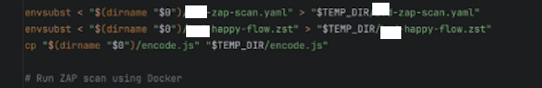

# ZAP-Gids Pipeline-integratie
## Portabiliteit en omgevingsvariabelen
Bij het werken met ZAP Automation Plans is het belangrijk om rekening te houden met portabiliteit. Scripts die lokaal goed functioneren, kunnen in een CI/CD-omgeving onverwachte problemen opleveren. Dit komt voornamelijk doordat omgevingsvariabelen (environment variables) anders zijn ingericht op een ontwikkelmachine dan in een pipeline-omgeving.

## Omgevingsvariabelen in YAML
Het ZAP Automation Framework interpreteert **géén** omgevingsvariabelen automatisch in YAML-velden zoals `urls` of `includePaths`. In tegenstelling tot bijvoorbeeld shellscripts of Docker Compose, wordt een waarde als `${RELEASE_NAME}` door ZAP beschouwd als een letterlijke string, tenzij je deze gebruikt in:

- een Zest-script, of
- een expliciet ondersteund veld zoals `env.parameters`

Houd hier dus rekening mee bij het verplaatsen of hergebruiken van automation plans tussen verschillende omgevingen.


⚠️ **Let op:** 
Variabelen in sequence worden niet overgenomen uit automation plan.

Je moet daarom een shell-script maken met `envsubst`
  


## ZAP-scan in GitLab CI/CD
De ZAP-scan kan worden geïntegreerd in de GitLab CI/CD-pipeline als een job in het bestand `.gitlab-ci.yml`. 

Dit zou er bijvoorbeeld als volgt uit kunnen zien.
```yaml
zap-scan:
  stage: zap
  image:
    name: zaproxy/zap-stable:latest

  allow_failure: true

  rules:
    - if: "$CI_COMMIT_BRANCH == $CI_DEFAULT_BRANCH"

  variables:
    ZAP_SCAN_DIR: "$CI_PROJECT_DIR/zap-scan"
    ZAP_REPORT_DIR: "$CI_PROJECT_DIR/zap-scan/reports"

    # Pas deze waarden per project of pipeline-omgeving aan.
    ZAP_TARGET_ENVIRONMENT: "test"
    ZAP_TARGET_URL: "https://example.test"

    # Gebruik een templatebestand waarin placeholders staan, bijvoorbeeld:
    # ${ZAP_TARGET_URL}, ${ZAP_TARGET_ENVIRONMENT}, ${ZEST_SCRIPT_PATH}
    ZAP_AUTOMATION_TEMPLATE: "$CI_PROJECT_DIR/zap-scan/zap-automation-plan.yaml.template"
    ZAP_AUTOMATION_PLAN: "$CI_PROJECT_DIR/zap-scan/zap-automation-plan.yaml"

    # Optioneel: alleen nodig wanneer het automation plan een Zest-script gebruikt.
    ZEST_SCRIPT_PATH: "$CI_PROJECT_DIR/zap-scan/flow.zst"

  # De ZAP-scan gebruikt een draaiende testomgeving.
  # Er zijn daarom geen build-artifacts uit eerdere jobs nodig.
  dependencies: []

  script:
    - mkdir -p "$ZAP_REPORT_DIR"

    # Deze stap is nodig omdat variabele expansie niet overal in ZAP Automation Plans werkt.
    # De placeholders worden daarom vooraf vervangen met envsubst.
    - envsubst < "$ZAP_AUTOMATION_TEMPLATE" > "$ZAP_AUTOMATION_PLAN"

    - zap.sh -cmd -autorun "$ZAP_AUTOMATION_PLAN"

  artifacts:
    when: always
    paths:
      - zap-scan/reports
```

Deze taak doet het volgende:
1. Draait in de `zap`-stage van de pipeline.
2. Gebruikt het Docker-image `zaproxy/zap-stable:latest`.
3. Wordt uitgevoerd wanneer de pipeline op de default branch draait.
4. Stelt generieke omgevingsvariabelen in voor de ZAP-scan, zoals de doel-URL, de doelomgeving, de locatie van het automation plan en de rapportagemap.
5. Maakt de rapportagemap aan.
6. Vervangt placeholders in het templatebestand met `envsubst`, zodat een concreet ZAP Automation Plan ontstaat.
7. Start de ZAP-scan met `zap.sh` en het gegenereerde automation plan.
8. Slaat de rapporten op als artefacten, zodat deze na afloop van de pipeline beschikbaar zijn via de GitLab-UI.
