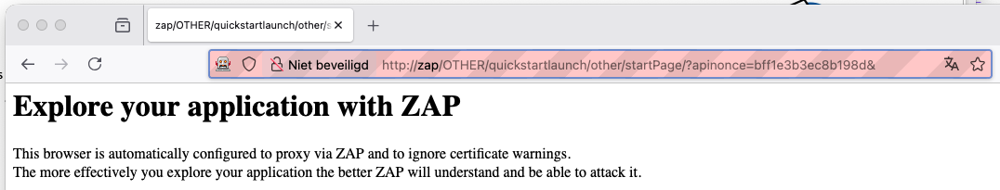
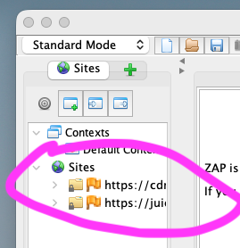
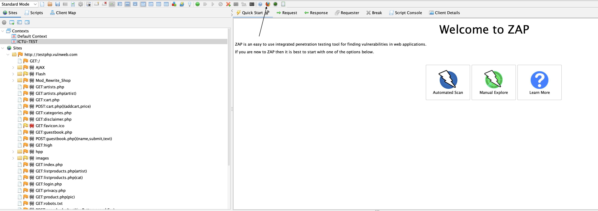
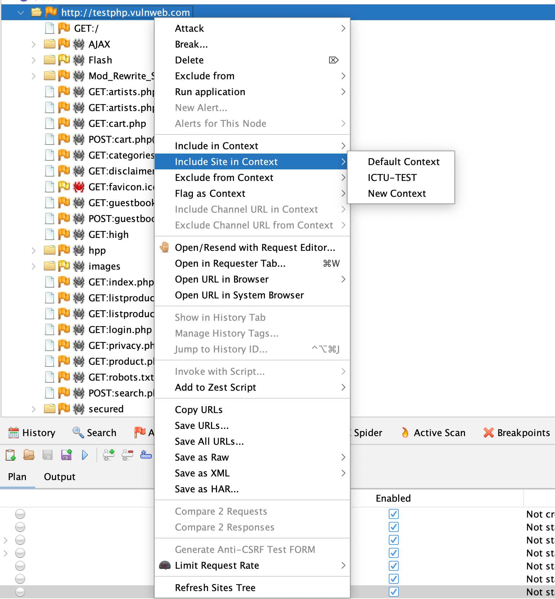
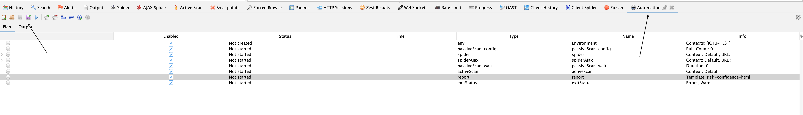

# ZAP Stappenplan ZAP-script maken

## Samengevat
- ZAP kun je gebruiken voor een actieve aanval (ad hoc) of geautomatiseerd middels een automation plan (zie [Gids Automation Plan]). Dit is verder uitgelegd in $LINK_ZAP_VERDIEPING_EN_BEGRIPPEN$.
- In dit stappenplan wordt eerst een context gemaakt. Dit is een verzameling URL's die later kan worden gebruikt voor beide typen gebruikswijzen (ad hoc of geautomatiseerd).
- We voegen deze context toe aan een automation plan, zodat dit later in een CI/CD-pipeline kan worden uitgevoerd.
- Als laatste stap kan er een Zest-script worden toegevoegd aan het automation plan om daadwerkelijk stappen te doorlopen die later ook in die volgorde worden uitgevoerd.

In dit stappenplan wordt de desktopapplicatie gebruikt. 
Volg deze instructies om ZAP te downloaden en te installeren: [Download ZAP en installeer ZAP](#download-en-installatie-voor-desktop)

## Stap 1 — Een opname maken
Om het verkeer op te nemen, wordt geadviseerd om de geïntegreerde browser van ZAP (zie screenshot) te gebruiken, omdat die vooringesteld is. 

⚠️ **Let op:** Dit is geen opname waarbij de stappen op volgorde kunnen worden afgespeeld. Dit registreert alleen alle calls/endpoints.

Als doelwit/testobject kun je gebruikmaken van onderstaande testwebsites.
- https://juice-shop.herokuapp.com/#/
- https://demo.owasp-juice.shop/
- https://demo.weblock.ru
- http://testphp.vulnweb.com/
- of kies hier een site: https://automationpanda.com/2021/12/29/want-to-practice-test-automation-try-these-demo-sites/

Wanneer je webbrowser eruitziet als hieronder, dan is het goed.


Als je dan naar de pagina gaat, moeten er in de zijbalk van ZAP Sites tevoorschijn komen. Dit is de opname.


- Gebruik de geïntegreerde browser van de ZAP GUI of;
- Zet je browser (Firefox/Chromium) op `http://localhost:8090`. 
- Bezoek de webapplicatie of webpagina → requests verschijnen in **History**.  
- ZAP functioneert als **MITM-proxy**: al het verkeer wordt zichtbaar en kan later opnieuw worden afgespeeld.  

*De browser die geïntegreerd is in ZAP en standaard via de proxy loopt.*

⚠️ Wanneer je de melding krijgt: `PR_CONNECT_RESET_ERROR` of `Kan geen verbinding maken`  

## Stap 2 — Een context maken
Een context wordt gebruikt om de scope te bepalen van een scan/test. Het is het beste om dit te doen per webapplicatie die je wil scannen/testen/aanvallen. Een context zorgt ervoor dat ZAP de *niet* relevante endpoints *niet* meeneemt in een scan/test/aanval. De meeste webpagina's maken namelijk ook allerlei aanroepen naar websites die niet getest/aangevallen moeten worden met ZAP, zoals bv. een aanroep naar Google o.i.d.).

Deze stap (een context maken) kun je ook voorafgaand aan de opname doen (dan werkt het als een include/exclude). Toch adviseren wij om dit als tweede stap te doen, omdat je niet altijd weet welke calls je webapplicatie maakt en welke calls je daarvan wil behouden. Er is dan eerst een (grote) lijst met URL's van de endpoints als resultaat van de opname. Hierna kan een selectie worden gemaakt tussen wat *wel* moet worden behouden en wat *niet*.

> Meer info hierover is te lezen op.
> https://www.zaproxy.org/docs/desktop/start/features/contexts/

- Rechtsklik op de site in **Sites** → *Include in Context → New Context*.  
- Definieer:
  - **IncludePaths / ExcludePaths** (regex ondersteund)  
  - (Optioneel) **Authentication** + **Users** + **Session Management**  
- Test je instellingen met de **Authentication Tester**.  

*Hier maak je de context aan, dit is de centrale configuratie die ZAP vertelt wat er bij een applicatie hoort en hoe deze werkt.*

## Stap 3 — Verkennen (passive scan)
ZAP kent verschillende soorten *'scans'* als stappen. De 'passive scans' zijn stappen waarin ZAP fungeert als crawler/spider. De tool gaat op de pagina op zoek naar hyperlinks en calls en verzamelt deze en volgt de links ook. Op de gevonden andere pagina's doet hij hetzelfde, enzovoorts.

Het voordeel van deze passive scan is dat er een lijst wordt opgebouwd van endpoints buiten het opgenomen klikpad die later weer kunnen worden gescand/getest/aangevallen. 

Je kunt 'ad hoc' scannen, ter oriëntatie en om resultaten te verwerken in een context.
Een passive scan kan ook onderdeel zijn van een automation plan, maar dan moet je eerst een automation plan maken en daarna de passive scan toevoegen.

- **Spider**: ontdekt links op basis van HTML-structuur.  
- **Ajax Spider**: gebruikt een echte browser en is geschikt voor SPA’s (React/Angular/Vue).  
- **OpenAPI import**: laad je API-spec om endpoints in scope te krijgen.

Een passive scan doe je zodat je ook andere links (buiten je opname-klikpad) kunt ontdekken, die later kunnen worden aangevallen. Het is een soort netscan / portscan. Je kunt hiermee alle endpoints in kaart brengen en de context uitbreiden, zodat deze later kan worden gebruikt in een aanval (active scan).

## Stap 4 — Actieve scan

Je kunt nu een actieve scan doen ingeval je een ad-hoctest zou willen doen.
Om dit te doen, volg onderstaande stappen.
- Rechtsklik op een context of node → *Attack → Active Scan*.  
- Kies **scan-policy** en stel **limieten** in:  
  - `maxScanDurationInMins`  
  - `maxRuleDurationInMins`  
  - `threadsPerHost`  

## Stap 5 — Rapportage
- *Report → Generate Report* → kies `traditional-html` en/of `traditional-xml`.  

## Stap 6 — Automation Plan genereren
- Open het tabblad **Automation** → *Generate Plan* → exporteer als `af-plan.yaml`.  
- Headless uitvoeren:
```bash
zap.sh -cmd -autorun /zap/wd/af-plan.yaml
```

*Het Automation Panel, waar je gemaakte automation plans kan inzien en exporteren.*


⚠️ **Belangrijk**: stel **exit-criteria** in (via `exitStatus` job) om te voorkomen dat scans onbeperkt draaien of CI/CD altijd slaagt.
