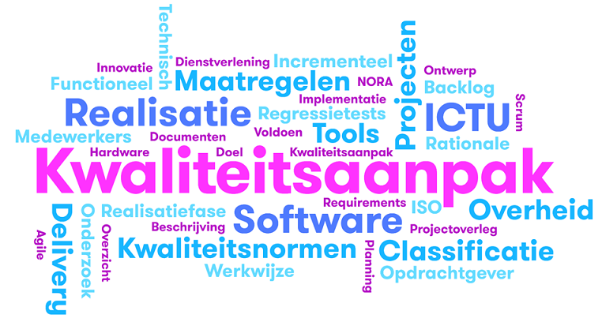

# Kwaliteitsaanpak ICTU Software Realisatie

Versie 1.1.53

## Wijzigingsgeschiedenis

### Algemeen

- Versie 1.2, onder handen
  - M01: Niet alle producten hoeven door het project te worden gemaakt.
  - M02: Zo snel mogelijk voldoen aan kwaliteitsnormen in plaats van altijd.
  - M13: Verduidelijkt dat het om het toepassen van ISO-25010 in projecten gaat.
  - M25: De inhoud is verplaatst naar M01, M25 zelf is vervallen.
- Versie 1.1, 7 november 2017
  - BIR-maatregelen toegevoegd.
- Versie 1.0.2, 9 mei 2017
  - Eerste publicatie

### ICTU-specifiek

- Versie 1.2, onder handen
  - Manifest toegevoegd
  - ICTU-specifieke invulling van maatregelen aangepast aan nieuwe organisatiestructuur en rollen zoals die in 2018 gelden.

## Inhoudsopgave

- [Manifest](#manifest)
- [Inleiding](#inleiding)
- [Doelstellingen van de kwaliteitsaanpak](#doelstellingen-van-de-kwaliteitsaanpak)
- [Leeswijzer](#leeswijzer)
- [Producten](#producten)
  * [Maatregel 1: Op te leveren producten (M01)](#maatregel-1-op-te-leveren-producten-m01)
  * [Maatregel 2: Continu voldoen aan kwaliteitsnormen (M02)](#maatregel-2-continu-voldoen-aan-kwaliteitsnormen-m02)
  * [Maatregel 3: Traceerbaar voldoen aan eisen (M03)](#maatregel-3-traceerbaar-voldoen-aan-eisen--m03)
  * [Maatregel 4: Geautomatiseerde regressietests (M04)](#maatregel-4-geautomatiseerde-regressietests-m04)
  * [Maatregel 26 : Periodieke beoordeling informatiebeveiliging (M25)](#maatregel-26--periodieke-beoordeling-informatiebeveiliging-m25)
- [Processen](#processen)
  * [Maatregel 5: Iteratief en incrementeel ontwikkelproces (M05)](#maatregel-5-iteratief-en-incrementeel-ontwikkelproces-m05)
  * [Maatregel 6: Frequente meting (M06)](#maatregel-6-frequente-meting-m06)
  * [Maatregel 7: Continuous delivery pipeline (M07)](#maatregel-7-continuous-delivery-pipeline-m07)
  * [Maatregel 8: Technische schuld (M08)](#maatregel-8-technische-schuld-m08)
  * [Maatregel 9: Implementatie kwaliteitsaanpak (M09)](#maatregel-9-implementatie-kwaliteitsaanpak-m09)
  * [Maatregel 10: Periodiek projectoverleg (M010)](#maatregel-10-periodiek-projectoverleg-m010)
  * [Maatregel M27 - Projecten expliciet afsluiten (M27)](#maatregel-m27---projecten-expliciet-afsluiten-m27)
- [Project Organisatie](#project-organisatie)
  * [Maatregel 11: Beheer en onderhoud kwaliteitsaanpak en -normen (M011)](#maatregel-11-beheer-en-onderhoud-kwaliteitsaanpak-en--normen-m011)
  * [Maatregel 24: Implementatie van wijzigingen aan de kwaliteitsaanpak en -normen (M024)](#maatregel-24-implementatie-van-wijzigingen-aan-de-kwaliteitsaanpak-en--normen-m024)
  * [Maatregel 12: Publicatie kwaliteitsaanpak en -normen (M012)](#maatregel-12-publicatie-kwaliteitsaanpak-en--normen-m012)
  * [Maatregel 13: Gebruik van ISO-25010 (M013)](#maatregel-13-gebruik-van-iso-25010-m013)
  * [Maatregel 14: Projecten splitsen in een voorbereidingsfase en een realisatiefase (M014)](#maatregel-14-projecten-splitsen-in-een-voorbereidingsfase-en-een-realisatiefase-m014)
  * [Maatregel 15: Open source tools (M015)](#maatregel-15-open-source-tools-m015)
  * [Maatregel 16: Verplichte tools (M016)](#maatregel-16-verplichte-tools-m016)
  * [Maatregel 17: Snel beschikbare tools (M017)](#maatregel-17-snel-beschikbare-tools-m017)
  * [Maatregel 18: Ondersteuning verplichte tools (M018)](#maatregel-18-ondersteuning-verplichte-tools-m018)
  * [Maatregel 19: Digitale werkomgeving (M019)](#maatregel-19-digitale-werkomgeving-m019)
  * [Maatregel 21: Kwaliteit van medewerkers (M021)](#maatregel-21-kwaliteit-van-medewerkers-m021)
  * [Maatregel 22: Betrokkenheid bij inzet (M022)](#maatregel-22-betrokkenheid-bij-inzet-m022)
  * [Maatregel 23: Warme kennisoverdracht (M023)](#maatregel-23-warme-kennisoverdracht-m023)
- [Bijlagen](#bijlagen)
  * [Hoe de kwaliteitsaanpak het manifest ondersteunt](#hoe-de-kwaliteitsaanpak-het-manifest-ondersteunt)
  * [Risico's van softwareontwikkeling](#risicos-van-softwareontwikkeling)

## Manifest

ICTU werkt aan een betere digitale overheid. Wij willen het niveau van software-ontwikkeling bij de Nederlandse overheid naar een hoger plan brengen. In ons werk zijn we het volgende gaan waarderen:

- **Het belang van de burger staat voorop.**
  Omdat burgers en ambtenaren die diensten verlenen aan burgers, de belangrijkste afnemers van ons werk zijn.
- **We delen wat we goed kunnen en gebruiken wat anderen beter doen.**
  Omdat wij hiermee sneller tot goede oplossingen komen.
- **Op zoek naar de juiste oplossing is het experiment soms de kortste weg.**
  Omdat wij open staan voor bruikbare en effectieve oplossingen die kunnen afwijken van standaardmethodes.
- **Wij geloven in agile werken bij de overheid.**
  Omdat wij graag samen met de klant werken aan passende oplossingen.
- **Wij geven inzicht in de kwaliteit van ons werk.**
  Omdat wij geloven dat openheid leidt tot een goede samenwerking en een beter resultaat.

Deze kwaliteitsaanpak ondersteunt het realiseren van deze waarden.

## Inleiding

Met de verregaande automatisering en digitalisering wordt software meer en meer belangrijk. Ook binnen de overheid. Naast het op orde hebben van zaken als licenties van standaardsoftware ligt er een uitdaging als het gaat om de ontwikkeling van maatwerksoftware. Projecten waarin software wordt ontwikkeld of onderhouden kampen nog vaak met vertraging, budgetoverschrijding of een eindresultaat met te lage kwaliteit. Zo concludeerde de commissie-Elias bijvoorbeeld in haar eindrapport: 'De Rijksoverheid heeft haar ICT-projecten niet onder controle'.

Eén van de fundamentele problemen is dat de risico's die inherent zijn aan softwareontwikkeling door organisaties nog onvoldoende worden erkend en gemitigeerd.

Terwijl de risico's bij de ontwikkeling van maatwerksoftware inmiddels algemeen bekend zijn en er ook voor veel risico's passende maatregelen beschikbaar zijn.

ICTU werkt sinds 2010 met de agile softwareontwikkelaanpak Scrum en heeft deze aanpak aangevuld en uitgebreid om zoveel mogelijk de kans op die risico's te verminderen. Denk hierbij aan geautomatiseerde regressietesten om het risico op fouten bij nieuwe opleveringen van de software (die bij Scrum elke twee of drie weken plaatsvinden) te voorkomen. Een ander voorbeeld is het zeer frequent − meerdere keren per uur - geautomatiseerd rapporteren over de kwaliteit van de software om zogenaamde 'technische schuld' te voorkomen.

Met behulp van deze kwaliteitsaanpak heeft ICTU samen met andere overheden inmiddels enige tientallen projecten succesvol uitgevoerd. ICTU wil deze aanpak graag aanvullen met de ervaringen en geleerde lessen van andere organisaties en deze overdraagbaar maken en breder uitdragen. Daarom stelt ICTU deze kwaliteitsaanpak ter beschikking aan andere partijen en overheden die zelf maatwerk software ontwikkelen of dit laten doen.

## Doelstellingen van de kwaliteitsaanpak

De kwaliteitsaanpak heeft 3 doelstellingen:

1. Opdrachtgevers helpen bekende risico's bij softwareontwikkeling, zoals technische schuld, vertraging en defecten, zo veel mogelijk te voorkomen.

2. ICTU helpen om software te ontwikkelen die de missie van ICTU, namelijk bijdragen aan een betere digitale overheid, ondersteunt.

3. De overheid als geheel helpen bij het zo goed mogelijk ontwikkelen van software.

De kwaliteitsaanpak zelf is geformuleerd in de vorm van maatregelen die elke software-ontwikkelende organisatie kan treffen om risico's van softwareontwikkeling te mitigeren en de kans op succesvolle softwareontwikkeling en -onderhoudsprojecten te vergroten. De maatregelen zijn beschreven in algemene termen. Waar van toepassing is ook de ICTU-specifieke invulling van de maatregel telkens separaat bijgevoegd.

De beschrijving van de kwaliteitsaanpak in dit document is gebaseerd op de huidige aanpak van softwareontwikkeling en -onderhoud bij ICTU. Deze kwaliteitsaanpak is expliciet bedoeld als een evoluerende aanpak, die verbeterd wordt op basis van praktijkervaringen bij ICTU en - op termijn - bij andere organisaties.

## Leeswijzer

Dit document 'Kwaliteitsaanpak ICTU Software Realisatie' is bedoeld voor programmatuur en gerelateerde producten, voor processen waarmee die producten worden gerealiseerd en voor de overkoepelende organisatie waarin op projectbasis wordt gewerkt. Dit betekent dat deze kwaliteitsaanpak betrekking heeft op de drie aspecten van softwareontwikkeling:

1. Producten - Het eerste deel van de kwaliteitsaanpak betreft de eigenschappen van de ontwikkelde producten. De broncode valt hieronder, maar ook alle andere producten, zoals documenten en testscripts.

2. Processen - Het tweede deel van de aanpak betreft het ontwikkelproces; dit gaat over werkwijze, gebruik van hulpmiddelen en projectaanpak.

3. Organisatie - Het derde deel van de kwaliteitsaanpak heeft betrekking op de overkoepelende ontwikkelorganisatie waarbinnen projecten worden uitgevoerd (bij ICTU is dat de afdeling ICTU Software Realisatie (ISR)); dit gaat over de samenhang tussen projecten en de faciliteiten die projecten ter beschikking moeten hebben.

De drie aspecten komen hieronder in meer detail aan bod in de vorm van maatregelen die ICTU heeft getroffen om de risico's die samenhangen met softwareontwikkeling te mitigeren. Bijlage 1 beschrijft de relatie tussen risico's en maatregelen.

De beschrijving van elke maatregel is voorzien van een rationale: waarom behoort de maatregel tot de kwaliteitsaanpak? In gevallen waarbij een maatregel een specifieke invulling heeft bij ICTU, is daarvoor een aparte paragraaf voor opgenomen.

Bij de omschrijving van de maatregelen is gebruik gemaakt van de volgende 'rollen' om aan te geven wie verantwoordelijkheid draagt voor het uitvoeren van de maatregelen:

1. Projectenorganisatie (bij ICTU: de afdeling ICTU Software Realisatie (ISR))

2. Hoofd projectenorganisatie (bij ICTU: afdelingshoofd ISR)

3. Project (bij ICTU: project inclusief Scrumteam(s))

4. Projectverantwoordelijke (bij ICTU: software delivery manager en/of projectleider)

5. Kwaliteitsmanager (bij ICTU: een door de software delivery manager en/of projectleider aangestelde kwaliteitsmanager of de software delivery manager zelf)

## Producten

### Maatregel 1: Op te leveren producten (M01)
Projecten zijn gesplitst in een voorbereidingsfase en een realisatiefase (zie M14 Projecten splitsen in een voorbereidingsfase en een realisatiefase); alle fasen kennen specifieke producten. De onderstaande tabel benoemt de producten die een project in die fasen moet realiseren of waarover het project moet kunnen beschikken, indien er andere auteurs zijn (bijvoorbeeld de opdrachtgever). Het project zorgt voor een volledige oplevering van alle genoemde producten, waaronder de producten die niet door het project zelf zijn gemaakt.

Als tijdens een project bestaande software dient te worden afgebouwd, onderhouden en/of herbouwd, vindt een onderzoek plaats naar de compleetheid en consistentie van de bestaande softwareproducten aan de hand van de onderstaande tabel (inclusief de deliverables in de kolom 'Realisatiefase') en wordt de kwaliteit van de bestaande software-producten getoetst (M02 Continu voldoen aan kwaliteitsnormen). Dit onderzoek is onderdeel van de voorbereidingsfase en wordt uitgevoerd door vertegenwoordigers van de projectenorganisatie en medewerkers van het desbetreffende project.

| Product | Voorbereidingsfase  | Voorbereidingsfase met onderzoek  | Realisatiefase | 
|----------------------------------------------------------------------------------------|---|---|---| 
| business impact analysis (BIA)*                                                        | + | + | + |
| privacy impact analysis (PIA)**                                                        | + | + | + |
| beschrijving van functionele eisen                                                     | + | + | + | 
| beschrijving van niet-functionele eisen                                                | + | + | + | 
| ontwerp- en architectuurdocumentatie (software, interactie, infrastructuur)            | + | + | + | 
| testdocumentatie: testplannen                                                          | + | + | + | 
| testdocumentatie: testgevallen, rapportages                                            |   |   | + |
| informatiebeveiligingsplan                                                             | + | + | + | 
| projectplan                                                                            | + | + |   | 
| kwaliteitsplan                                                                         | + | + |   | 
| deploybare versie van de software                                                      |   |   | + | 
| broncode, inclusief de benodigdheden voor het bouwen van de software                   |   |   | + | 
| regressietests, inclusief de benodigdheden voor het uitvoeren van de regressietesten   |   |   | + | 
| vrijgaveadvies                                                                         |   |   | + | 
| release notes                                                                          |   |   | + | 
| deploymentdocumentatie                                                                 |   |   | + | 
| uitkomsten onderzoek (bevindingen, risico's, mitigerende maatregelen)                  |   | + |   |
| transitieplan voor af te bouwen, te onderhouden en/of te herbouwen softwareproducten   |   | + |   | 
| plan voor aflossen technische schuld, indien van toepassing                            |   | + |   ||

*) De opdrachtgever stelt bij voorkeur een BIA en PIA voorafgaand aan een voorbereidende fase beschikbaar. Indien dat niet mogelijk is worden deze analyses gedurende de voorbereidende fase onder verantwoordelijkheid van de opdrachtgever uitgevoerd.
**) Indien een PIA niet nodig is, is een verklaring daaromtrent vereist.

#### Rationale

Het uniformeren van op te leveren producten biedt voordelen voor planning (het is bekend welke producten gemaakt moeten worden), voor bemensing (het is bekend welke expertise nodig is) en voor het uitwisselen van medewerkers.

De voorgeschreven producten stellen de ontvanger in staat om de opgeleverde software uit te voeren, te beheren en te onderhouden. Daarnaast is duidelijk welke eventueel openstaande punten er nog zijn. De voorgeschreven producten bieden voldoende verantwoording richting de ontvanger voor uitgevoerde werkzaamheden.

De genoemde producten uit de voorbereidingsfase hebben tot doel om enerzijds de omvang, kosten en doorlooptijd van de realisatiefase te kunnen schatten en anderzijds om de kaders voor de realisatiefase te bepalen, zodat de scope, aanpak en oplossingsrichting in grote lijnen bekend zijn.

Een BIA en eventuele PIA zijn richtinggevend voor de in de voorbereidingsfase te selecteren beveiligingsmaatregelen en zijn daarom, bij voorkeur, voorafgaand aan het project al beschikbaar.

In een BIA legt de vragende organisatie vast hoe belangrijk informatiebeveiliging is voor de eigen bedrijfsvoering/processen. Naast de gevoeligheid voor incidenten komt hierin ook de 'risk appetite' van de organisatie tot uiting. Alleen de organisatie zelf kan hierover een uitspraak doen.

In een PIA legt de vragende organisatie vast wat de privacy-gevoeligheid is van de gegevens die in een proces of systeem worden verzameld en verwerkt. Zicht op privacygevoelige gegevens en het (laten) treffen van adequate en afdoende beschermingsmaatregelen is een wettelijke plicht die een organisatie niet aan een andere partij kan verdragen.
#### ICTU

ICTU hanteert de volgende documenten, templates en documentstandaarden voor softwarerealisatieprojecten:

- De beschrijving van niet-functionele eisen is gebaseerd op ISO-25010, BIR en SSD, en bevat een prioritering van de niet-functionele eisen. De beschrijving van niet-functionele eisen is gebaseerd op het ICTU NFE-template. De beschrijving bevat in ieder geval eisen aan toegangsbeveiliging, aan beheerfuncties, aan logging en aan het gewenste gedrag van de software bij uitval van infrastructurele diensten zoals een log-server;

- De beschrijving van functionele eisen bestaat uit een geprioriteerde backlog met epics en/of user stories. De beschrijving bevat in ieder geval eisen voor (ondersteuning van) beheerfuncties die door de beoogd beheerder gesteld worden en voor logging, inclusief de (globale) inhoud van te loggen business events (gebeurtenissen op procesniveau) en de daarvoor geldende bewaartermijnen;

- De ontwerp- en architectuurdocumentatie bestaat uit een projectstartarchitectuur (PSA), een softwarearchitectuurdocument (SAD), een infrastructuurarchitectuur (IA), een globaal functioneel ontwerp (GFO) bijvoorbeeld in de vorm van use cases, en een prototype en/of interactieontwerp. De SAD, IA en GFO zijn gebaseerd op de ISR-templates. De architectuurdocumenten moeten expliciet inzichtelijk maken hoe aan de niet-functionele 
eisen wordt voldaan door uit te werken welke (beveiligings)mechanieken gekozen zijn, bijvoorbeeld voor identificatie, authenticatie, autorisatie, versleuteling of logging;

- De testdocumentatie bestaat uit een master testplan, gemaakt op basis van een productrisicoanalyse (PRA). Beveiligingstesten zijn een integraal onderdeel van het mastertestplan en worden als zodanig afgestemd met de opdrachtgever;

- Het informatiebeveiligingsplan is gebaseerd op een dreigingen- en kwetsbaarhedenanalyse (TVA, threat and vulnerability assessment) en bevat een maatregelenselectie informatiebeveiliging. De TVA wordt tijdens de voorfase opgesteld op basis van de resultaten van de BIA, de eventuele PIA en inhoud van de ontwerp- en architectuurdocumentatie. Een TVA levert een deel van een traceerbare onderbouwing voor de te treffen beveiligingsmaatregelen.

- Het vrijgaveadvies bevat ten minste alle nog openstaande testbevindingen en geconstateerde beveiligingsbevindingen. Zie ook maatregel M26 Periodieke beoordeling informatiebeveiliging en M16 Verplichte tools. Indien er beveiligingsissues zijn, zijn deze voorzien van een beschreven voorziene impact.

- De deploymentdocumentatie bevat informatie over de eisen die een applicatie stelt aan een omgeving en de stappen die nodig zijn om de applicatie in die omgeving veilig te installeren en configureren. De documentatie bevat daartoe onder meer aanwijzingen voor de HTTP-header en -request configuratie van de webserver en voor het verwijderen van overbodige header-informatie zoals de 'Server'-header. Ook zijn er aanwijzingen voor veilige configuratie(s) van (externe) toegang tot de beheerinterface. De documentatie bevat daarnaast in ieder geval een beschrijving van de protocollen en services die de applicatie aanbiedt, de protocollen, services en accounts die het product gebruikt en de protocollen, services en accounts die de applicatie gebruikt voor beheer. 

Zie Bijlage documenten voor maatregel M1 voor een uitgebreider overzicht van de documenten en documentstandaarden die ICTU hanteert voor softwarerealisatieprojecten.

Het genoemde onderzoek voert ICTU uit als onderdeel van een "due diligence". Een due diligence wordt uitgevoerd in samenwerking met een potentiële opdrachtgever en biedt, naast het genoemde onderzoek, ook de opdrachtgever de kans zich een oordeel te vormen over de werkwijze van ICTU en de verwachte samenwerking.

### Maatregel 2: Continu voldoen aan kwaliteitsnormen (M02)

Producten voldoen zo snel mogelijk vanaf de start van een project aan de door het project en projectenorganisatie vastgestelde kwaliteitsnormen. De kwaliteit van producten die nog niet zijn afgerond of nog niet aan de normen voldoen, wordt door het project bewaakt. Herstel van de kwaliteit wordt planmatig opgepakt (zie ook M08 Technische schuld).

De kwaliteitsnormen zijn in deze versie van de kwaliteitsaanpak nog niet opgenomen.

#### Rationale

Het zo snel mogelijk en continu voldoen aan de kwaliteitsnormen beperkt toekomstige hersteltijd. Het dwingt tevens een structurele kwaliteitscontrole af.

#### ICTU

Bij ICTU wordt tijdens de voorfase van softwarerealisatieprojecten het voldoen aan de kwaliteitsnormen met behulp van reviews gecontroleerd. Tijdens de realisatiefase van softwarerealisatieprojecten wordt het voldoen aan de kwaliteitsnormen diverse malen per uur gemeten door het 'Kwaliteitssysteem' (HQ). Het project kijkt dagelijks of er afwijkingen van de normen zijn en onderneemt actie indien nodig. Ook de kwaliteitsmanager signaleert afwijkingen en meldt deze bij het project. De ICTU-specifieke invulling van de kwaliteitsnormen is te vinden in het helpmenu van de geautomatiseerde kwaliteitsrapportages van ICTU.

### Maatregel 3: Traceerbaar voldoen aan eisen  (M03)
Eisen zijn wederzijds traceerbaar naar bewijsmateriaal, zoals logische testgevallen, dat de eis gerealiseerd is; dat wil zeggen dat geadministreerd is bij welke eis bewijsmateriaal hoort en vice versa. Dit wordt waar mogelijk met tooling ondersteund.

#### Rationale
Door eisen en testgevallen te koppelen en traceerbaar te maken, is het mogelijk de dekking van tests ten opzichte van eisen te bepalen.

#### ICTU
Functionele eisen in de vorm van user stories zijn gekoppeld aan logische testgevallen. Ontwerpdocumentatie in de vorm van use cases is gekoppeld aan logische testgevallen. ICTU gebruikt hiervoor Jira. Logische testgevallen zijn gekoppeld aan fysieke testgevallen. De fysieke testgevallen worden geannoteerd met een identifier van de logische testgevallen. Het project is verantwoordelijk voor het traceerbaar voldoen aan de eisen.

Niet-functionele eisen zijn gekoppeld aan onder andere softwarearchitectuurdocument, mastertestplan en detailtestplannen. De traceerbaarheid hiervan is (nog) niet geadministreerd met behulp van tooling.

### Maatregel 4: Geautomatiseerde regressietests (M04)

Regressietests - tests die verifiëren of eerder ontwikkelde software nog steeds correct werkt na wijzigingen in de software of aansluiting op andere externe koppelvlakken - zijn geautomatiseerd.

#### Rationale
Handmatig uitgevoerde regressietests zijn arbeidsintensief, foutgevoelig en afhankelijk van de aanwezigheid van specifieke medewerkers. Gelet op de vrijwel continue metingen op en leveringen van de programmatuur, zijn de nadelen van handmatige regressietests niet acceptabel. Door ze te automatiseren zijn ze herhaalbaar en kunnen ze onderdeel uitmaken van de 'continuous delivery pipeline' (zie M07 Continuous delivery pipeline).

#### ICTU
ICTU hanteert een norm voor de dekking van regressietests.

### Maatregel 26 : Periodieke beoordeling informatiebeveiliging (M25)

Projecten laten periodiek een beveiligingstest uitvoeren. De code wordt zowel geautomatiseerd als handmatig onderzocht op veelvoorkomende kwetsbaarheden door een beveiligingsexpert van buiten het project. De projectorganisatie zorgt ervoor dat deze expertise op afroep beschikbaar gesteld wordt aan projecten. Bevindingen uit de beveiligingstest worden vastgelegd als onderdeel van de werkvoorraad voor het ontwikkelproces (zie maatregel M05 Iteratief en incrementeel ontwikkelproces).

#### Rationale
Door het inschakelen van actuele, specifieke expertise wordt de kans vergroot dat eventuele kwetsbaarheden in de gerealiseerde software tijdig herkend worden. Doordat de projectenorganisatie deze expertise beschikbaar stelt, wordt voorkomen dat individuele projecten dat ieder voor zich moeten doen én dat beveiligingstesten als gevolg van (tijds)druk binnen projecten overgeslagen worden.
#### ICTU
Software wordt minimaal bij iedere grote release of tenminste twee keer per jaar onderworpen aan een beveiligingstest door beveiligingsexperts die ICTU daarvoor inhuurt. Op basis van documentatieen architectuurstudie, crystalbox security audits (broncodescan) en penetratieaudits beoordelen deze experts of de software voldoet aan de projectspecifieke niet-functionele eisen die met betrekking tot beveiliging aan de software zijn gesteld, of bekende kwetsbaarheden (OWASP) vermeden zijn en in hoeverre voldoende invulling gegeven is aan de normen vanuit die vanuit BIR en SSD gelden.

Indien door de opdrachtgever gewenst kunnen securitytesten door een onafhankelijke derde partij worden uitgevoerd in een daarvoor door de opdrachtgever beschikbaar gestelde omgeving. Dit kan zowel incidenteel als structureel worden ingericht. Afspraken hierover worden bij voorkeur al in de voorbereidingsfase gemaakt.

De beveiligingstesten vinden plaats in aanvulling op de door tools uitgevoerde continue beveiligingsanalyse van de gerealiseerde software, zie maatregel M16 Verplichte tools. Bevindingen uit zowel een beveiligingstest als de continue analyse worden in Jira als issue - gemarkeerd als beveiligingsbugreport - vastgelegd op de backlog van het project.

## Processen

### Maatregel 5: Iteratief en incrementeel ontwikkelproces (M05)

Projecten werken iteratief en incrementeel; dit betekent dat een project in korte iteraties werkt, 
waarbij elke iteratie een werkende versie van de software wordt opgeleverd die extra waarde oplevert voor de opdrachtgever. Behalve de software worden iedere iteratie telkens ook alle andere producten (Zie maatregel M01 Op te leveren producten) bijgewerkt en opgeleverd. Elke iteratie worden verwachtingen en werkelijke resultaten vergeleken en de werkwijze aangescherpt op basis van inzichten en bevindingen. Dit leidt tot een zich continu verbeterend proces.

#### Rationale
De incrementele oplevering levert (vrijwel) iedere iteratie toegevoegde waarde en stelt opdrachtgevers, gebruikers en anderen in staat om gaandeweg ervaring op te doen en bij te sturen. Verder dwingt het vroegtijdige tests en kwaliteitscontroles af, die daarmee verankerd worden in het ontwikkel- en onderhoudsproces. Door naast de software telkens ook alle andere producten bij te werken en op te leveren wordt bereikt dat het product als geheel consistent blijft en dat er geen achterstallig onderhoud ontstaat.
#### ICTU
ICTU gebruikt hiervoor Scrum, een raamwerk voor productontwikkeling. ICTU propageert de kernwaarden van Scrum en vereist de volgende Scrum-aspecten:
- Scrum team bestaand uit product owner, ontwikkelteam en Scrum master,
- Proces: daily scrum, sprints, sprint planning, sprint review, sprint refinement,
- Definition of Done,
- Definition of Ready,
- Product backlog.

Vast onderdeel van de Definition of Done is dat producten actueel en onderling consistent zijn (M01 Op te leveren producten) en voldoen aan de door de projectenorganisatie vastgestelde kwaliteitsnormen (M02 Continu voldoen aan kwaliteitsnormen).

### Maatregel 6: Frequente meting (M06)

Het voldoen aan de kwaliteitsnormen die geautomatiseerd gemeten kunnen worden, wordt frequent - minimaal één keer per dag - gemeten. De projectenorganisatie voorziet hierin (mensen en middelen).

#### Rationale
Vaak meten maakt een vrijwel actueel inzicht op elk moment mogelijk. Projectleden kunnen snel reageren op afwijkingen, die in de regel ook pas recent zijn ontstaan en dus meestal gerelateerd zijn aan huidige activiteiten. Met name afwijkingen van de normen op het vlak van informatiebeveiliging komen zo snel aan het licht en kunnen dan ook snel worden beoordeeld en - indien nodig en mogelijk - opgelost.

#### ICTU
Bij een ICTU-softwareproject is het voldoen aan de normen onderdeel van de 'Definition of Done' en wordt het voldoen aan kwaliteitsnormen meermaals per uur gemeten. Projecten nemen de kwaliteitsrapportage door tijdens de stand-up en tijdens het wekelijks projectoverleg.

### Maatregel 7: Continuous delivery pipeline (M07)

Er is een geautomatiseerde continuous delivery pipeline die aantoonbaar correct werkt en ten minste de volgende activiteiten uitvoert:

- bouw van de software,
- kwaliteitscontroles,
- regressietests,
- performance tests,
- beveiligingstests,
- unit tests,
- installatie van de software,
- oplevering van het totale product, dus inclusief alle deliverables, in de vorm zoals bruikbaar voor en afgesproken met de opdrachtgever.

De projectenorganisatie voorziet in mensen en hulpmiddelen, zodat projecten deze pipeline kunnen toepassen. Projecten zijn verantwoordelijk voor de correcte werking van de pipeline.

#### Rationale
Software incrementeel opleveren (zie M05 Iteratief en incrementeel ontwikkelproces) vereist dat de software frequent gebouwd, getest en opgeleverd kan worden. Om dit efficiënt en foutvrij te doen, dient het proces van bouwen, testen en opleveren geautomatiseerd te zijn; een continuous delivery pipeline faciliteert dit.

#### ICTU
ICTU gebruikt Jenkins of Team Foundation Server (TFS) als tool voor de implementatie van de continuous delivery pipeline. De ICTU release manager ondersteunt de laatste stap (oplevering van het totale product).

### Maatregel 8: Technische schuld (M08)

Technische schuld is inzichtelijk en wordt planmatig aangepakt. De kwaliteitsmanager is verantwoordelijk voor het inzichtelijk maken van de technische schuld. De projectverantwoordelijke is verantwoordelijk voor het planmatig aanpakken van de technische schuld.

#### Rationale
De aanwezigheid van technische schuld heeft nadelige invloed op de kwaliteit van de eindproducten. Anderzijds is het ontstaan van technische schuld gedurende een project vaak onvermijdelijk. Het is daarnaast ook mogelijk dat een deel van de technische schuld bij aanvang van het project al bestond en mogelijk niet wordt opgelost. In alle gevallen is het verstandig om te weten welke technische schuld bestaat. Om te voorkomen dat technische schuld niet wordt opgelost en uitsluitend toeneemt, is het zaak om het verminderen van technische schuld planmatig aan te pakken.

#### ICTU
ICTU gebruikt HQ (een door ICTU ontwikkeld, open source, geautomatiseerd kwaliteitssysteem) om bestaande technische schuld inzichtelijk te maken en de planning van het aflossen van de schuld vast te leggen, voor zover het technische schuld betreft van kwaliteitseigenschappen die HQ kan meten.

### Maatregel 9: Implementatie kwaliteitsaanpak (M09)

Projecten implementeren nieuwe versies van kwaliteitsaanpak en kwaliteitsnormen binnen de door de projectenorganisatie gestelde termijn (zie M12 Publicatie kwaliteitsaanpak en -normen voor het tot stand komen van de gestelde termijnen). De projectverantwoordelijke is verantwoordelijk voor de implementatie. 

De projectverantwoordelijke organiseert periodiek een zelf-assessment van het project tegen de kwaliteitsaanpak, identificeert de belangrijkste verschillen tussen kwaliteitsaanpak en werkwijze in het project en rapporteert hierover aan de projectenorganisatie. In overleg tussen projectverantwoordelijke en projectenorganisatie wordt besloten of het verschil tijdelijk of permanent wordt geaccepteerd. In het geval van tijdelijke acceptatie stelt de projectverantwoordelijke een verbeteractie op. Merk op dat de verbeteractie ook kan bestaan uit het opstellen van een verbetervoorstel voor de kwaliteitsaanpak. 

Voor de belangrijkste verschillen beschrijft de projectverantwoordelijke:
- Geconstateerde verschil
- Reden voor het verschil
- In geval van acceptatie: waarom het verschil geaccepteerd wordt
- In geval van verbeteractie: planning om het verschil weg te werken

#### Rationale
De implementatie van een nieuwe versie van de kwaliteitsaanpak kost tijd. De introductie en aanpassing van normen en tools, kunnen verschillende consequenties hebben. Bestaande broncode blijkt niet meer volledig te voldoen aan de normen, een nieuwe tool moet in de ontwikkelstraat worden toegevoegd, enzovoort.

Anderzijds is het voor de uniformiteit van kwaliteitsmeting en rapportage en de doorontwikkeling van de kwaliteitsaanpak van belang de implementatieperiode zo kort mogelijk en voorspelbaar te houden. Daarom stemt de projectenorganisatie met de projecten een implementatiemoment en implementatieperiode af.

Omdat implementatie van maatregelen in een project tijd kost is de zelf-assessment gericht op het in kaart brengen van de belangrijkste verschillen tussen kwaliteitsaanpak en de in het project toegepaste werkwijze en niet op het uitputtend inventariseren van alle verschillen.
#### ICTU
Bij ICTU speelt de software delivery manager de rol van projectverantwoordelijke zoals in deze maatregel beschreven. De software delivery manager stemt periodiek de zelf-assessmentresultaten af met het afdelingshoofd ISR.

### Maatregel 10: Periodiek projectoverleg (M010)

De projectverantwoordelijke organiseert een periodiek projectoverleg. Dit overleg vindt wekelijks plaats en duurt niet langer dan een uur.

Vereiste aanwezigen zijn de project-verantwoordelijke, een vertegenwoordiger uit het projectteam en een kwaliteits-manager. Andere aanwezigen kunnen zijn: opdrachtnemer, architecten en coaches.

De agenda voor dit overleg bestaat tenminste uit de volgende onderwerpen: 
- mededelingen - pro-actief informeren over voor het project relevante ontwikkelingen,
- actie- en besluitenlijst,
- personele zaken - bespreking van samenwerking binnen het team, in- en uitstroom, op- en afschalen,
- planning en voortgang - bespreking van voortgang ten opzichte van voorspelling en daaraan gerelateerde afwijkingen en knelpunten, leidend tot acties,
- kwaliteit en architectuur - bespreking van kwaliteit en architectuur (voor borging van inhoudelijke koers) en eventuele afwijkingen en benodigde acties,
- risico's en aandachtspunten.

#### Rationale
Het doel van het periodiek projectoverleg is alle direct-betrokkenen, breder dan het realiserende team, op hetzelfde informatieniveau te brengen en te houden. Direct-betrokkenen zijn alle medewerkers die geen onderdeel uitmaken van het realiserende team, maar wel eindverantwoordelijk of uitvoerend verantwoordelijk zijn voor het projectsucces.

#### ICTU
Bij periodiek projectoverleg zijn de software delivery manager, de kwaliteitsmanager en de scrum master vereist.

### Maatregel M27 - Projecten expliciet afsluiten (M27)

Na afronding van de realisatiefase worden projecten afgesloten. Alle documentatie, broncode, referentiedata en credentials die in de realisatiefase nodig waren of zijn opgeleverd, worden gearchiveerd en van werkstations van projectmedewerkers verwijderd. 

#### Rationale
Archiveren faciliteert het eventueel herstarten of overdragen van het project op een later tijdstip. Verwijderen neemt een onnodig risico op inbreuk op vertrouwelijkheid weg en vrijwaart projectmedewerkers en de projectenorganisatie van verdenking en aansprakelijkheid wanneer een incident optreedt.
#### ICTU
De software delivery manager is verantwoordelijk voor het archiveren. De SDM geeft het projectteam opdracht de archivering voor te bereiden en geeft het technisch beheerteam de opdracht de archivering uit te voeren.

## Project Organisatie

### Maatregel 11: Beheer en onderhoud kwaliteitsaanpak en -normen (M011)

De projectenorganisatie onderhoudt en beheert de kwaliteitsaanpak en de kwaliteitsnormen. Aanpassingen volgen uit praktijkervaring, nieuwe inzichten en nieuwe mogelijkheden voor meting en analyse. Iedereen kan wijzigingsvoorstellen indienen bij de projectenorganisatie.

Wijzigingsvoorstellen bevatten tenminste:
- het doel van de wijziging,
- een beschrijving van de wijziging,
- de sponsor van de wijziging,
- impact van de wijziging op lopende projecten (eenmalig en structureel),
- eventuele kosten (in euro's) van de wijziging (eenmalig en structureel),
- de belanghebbenden bij de wijziging,
- oplossingsvarianten,
- een onderbouwd advies ter besluitvorming.

De projectenorganisatie behandelt de wijzigingsvoorstellen, beslist de te nemen actie bij elk wijzigingsvoorstel en legt de wijzigingsvoorstellen en besluiten vast.

#### Rationale
Expliciet beheer en onderhoud van de kwaliteitsaanpak is nodig om lessen geleerd in projecten te kunnen verwerken, om nieuwe inzichten uit bijvoorbeeld wetenschappelijke literatuur te kunnen verwerken en om nieuwe technische mogelijkheden voor meting en analyse te verwerken. De kwaliteitsaanpak wordt door de projectenorganisatie - en niet door een project - onderhouden, zodat deze bij meerdere projecten kan worden toegepast.

Wijzigingsvoorstellen moeten een sponsor hebben zodat het duidelijk is dat iemand zich hard maakt voor het realiseren van de wijziging.

Wijzigingsvoorstellen bevatten een advies ter besluitvorming aan de projectenorganisatie. NB: het advies kan ook zijn de wijziging niet door te voeren. 

#### ICTU
Iedereen die betrokken is bij softwarerealisatieprojecten kan een wijzigingsvoorstel indienen bij het hoofd van de afdeling ICTU Software Realisatie (ISR). Het ISR-coordinatieteam behandelt de wijzigingsvoorstellen en faciliteert besluitvorming door het afdelingshoofd.

### Maatregel 24: Implementatie van wijzigingen aan de kwaliteitsaanpak en -normen (M024)
Bij elke wijziging aan de kwaliteitsaanpak en/of -normen stelt de projectenorganisatie vast of de wijziging leidt tot een wijziging in de werkwijze van de projecten. Als dit het geval is wijst de projectenorganisatie een sponsor van de wijziging aan die een implementatieplan voor de wijziging maakt en uitvoert. Het implementatieplan bevat ten minste:
- het doel van de wijziging,
- een beschrijving van de wijziging,
- de sponsor van de wijziging,
- de implementatie-aanpak (big bang, project-voor-project, incrementeel, etc.),
- de informatie die wordt gecommuniceerd met de projectmedewerkers en andere belanghebbenden en de manier waarop,
- de opleiding, training en/of instructies die gegeven zullen worden aan de projectmedewerkers en andere belanghebbenden en de manier waarop,
- de hulpmiddelen (templates, tools, rapportages) die geïmplementeerd en/of gewijzigd zullen worden en de manier waarop,
- de manier waarop  feedback die uit de projecten over de wijziging zal worden verzameld en verwerkt,
- de manier waarop de compleetheid van de implementatie zal worden bepaald (verificatie van de wijziging),
- de manier waarop bepaald zal worden of het doel van de wijziging is gerealiseerd (validatie van de wijziging).

#### Rationale
Wijzigingen aan de kwaliteitsaanpak en -normen hebben tot doel de organisatie in staat te stellen betere kwaliteit te leveren en/of op een efficiëntere manier te werken. Door wijzigingen te implementeren aan de hand van een implementatieplan met genoemde onderdelen dwingt de organisatie zich de implementatie doordacht uit te voeren én om de implementatie te verifiëren en te valideren. 

### Maatregel 12: Publicatie kwaliteitsaanpak en -normen (M012)

De projectenorganisatie publiceert periodiek, op een vaste, bekende locatie, een nieuwe versie van de kwaliteitsaanpak en/of de kwaliteitsnormen.

#### Rationale

Medewerkers moeten te allen tijde de actuele kwaliteitsaanpak en -normen kunnen raadplegen. Welke versie actueel is en wanneer een nieuwe versie actueel wordt, is essentiële informatie voor de planning van werkzaamheden binnen de projecten en binnen de afdeling als geheel.

#### ICTU
De kwaliteitsaanpak is te vinden op de afdelingsbrede wiki. Publicatie van een nieuwe versie wordt aangekondigd via een e-mail naar belanghebbenden en, indien relevant, 'de ICTU Software Realisatie-zeepkist'.
Bij ICTU zijn de kwaliteitsnormen (op dit moment) te vinden in elke kwaliteitsrapportage, in het 'helpmenu'.

### Maatregel 13: Gebruik van ISO-25010 (M013)

De standaard ISO/IEC 25010:2011, kortweg "ISO-25010", biedt een model voor het beschrijven van productkwaliteit. Kwaliteitseigenschappen zijn voorzien van een naam, definitie en classificatie. ISO-25010 dekt een breed spectrum van kwaliteitseigenschappen af.

Voor specificatie en documentatie van vereiste en gewenste kwaliteitseigenschappen, de niet-functionele eisen, maken projecten gebruik van de terminologie uit ISO-25010. Projecten gebruiken ISO-25010 om te controleren of alle relevante kwaliteitseigenschappen van het op te leveren eindproduct worden meegenomen in de ontwikkeling en/of onderhoud van het product.

#### Rationale
De standaard ISO-25010 biedt een model voor productkwaliteit. De standaard biedt geen concrete maatregelen, maar biedt wel een begrippenkader en dekt het volledige spectrum van mogelijk relevante kwaliteitseigenschappen af. Het gebruiken van een standaard voor specificatie van kwaliteit voorkomt miscommunicatie over kwaliteitseigenschappen en de breedte van de standaard zorgt ervoor dat alle relevante aspecten aan bod komen.
#### ICTU
ICTU gebruikt ISO-25010 voor documentatie en specificatie van productkwaliteit.

### Maatregel 14: Projecten splitsen in een voorbereidingsfase en een realisatiefase (M014)

Projecten hebben een voorbereidingsfase, voorafgaand aan de realisatiefase. Voor het uitvoeren van de voorbereidingsfase zijn vertegenwoordigers van de opdrachtgever en beoogde beheerpartij beschikbaar - dezelfde als betrokken zullen zijn in de realisatiefase - die meewerken aan het realiseren van een deel van de op te leveren producten (zie M01 Op te leveren producten). Tijdens de realisatiefase vindt de bouw en het onderhoud van de software plaats.

#### Rationale
Het doel van de voorbereidingsfase is ten eerste om uitgangspunten, risico's en randvoorwaarden voor verdere projectuitvoering te bepalen en ten tweede om te zorgen dat aan de randvoorwaarden wordt voldaan en voor zoveel mogelijk project-specifieke risico's maatregelen genomen zijn. Het doel van de realisatiefase is het daadwerkelijk bouwen en onderhouden van de software. Een expliciete splitsing zorgt ervoor dat projecten doordacht van start gaan.

Al tijdens de voorfase moeten keuzes gemaakt worden die invloed hebben op de beveiligingsmaatregelen. Aanwezigheid van een voldoende gemandateerde vertegenwoordiger van de opdrachtgever zorgt dat deze keuzes gemaakt en bekrachtigd kunnen worden. De keuzes komen onder meer tot uitdrukking in de ontwerp- en architectuurdocumentatie, zie M01 Op te leveren producten. De infrastructuur gerelateerde documentatie wordt opgesteld door de beoogd beheerder en dekt een deel van de totale beveiligingsmaatregelen af. Aanwezigheid van de beoogd beheerder in de voorfase zorgt dat dekking van dit deel van de beveiligingsmaatregelen geborgd blijft gedurende de realisatie en exploitatie.

#### ICTU
Bij ICTU heet de voorbereidingsfase van softwarerealisatieprojecten de 'voorfase'. In de realisatiefase wordt het Scrumteam aangestuurd door een product owner van de opdrachtgever. Bij aanvang van de voorfase is deze beoogde product owner bekend en hij/zij werkt ook mee in de voorfase.

### Maatregel 15: Open source tools (M015)

Bij de selectie van tools ter ondersteuning van de projectuitvoering  geeft de projectenorganisatie voorkeur aan open source tools.

#### Rationale
Conform de NORA rationale voor het gebruik van open source tools zoals beschreven in NORA v3.0 drijfveer “beleid open standaarden” (http://www.noraonline.nl/wiki/Beleid_open_standaarden).
#### ICTU
Tools die ICTU ontwikkelt ter ondersteuning van softwarerealisatieprojecten, worden bij voorkeur als open source beschikbaar gesteld.

### Maatregel 16: Verplichte tools (M016)

De projectenorganisatie stelt het gebruik van de volgende tools voor alle projecten verplicht:
1. Een tool dat agile werken ondersteunt. Een dergelijk tool voorziet in het opvoeren van eisen, het opvoeren van logische testgevallen en het koppelen van logische testgevallen aan eisen, het bijhouden van een werkvoorraad, het plannen van iteraties en het toewijzen van eisen aan iteraties.
2. Een tool dat het inrichten en uitvoeren van een continuous delivery pipeline ondersteunt.
3. Een tool dat het monitoren van de kwaliteit van broncode ondersteunt.
4. Een tool dat het releasen van software ondersteunt.
5. Een tool dat het maken van testrapportages ondersteunt.
6. Een tool dat het maken van kwaliteitsrapportages ondersteunt.
7. Een tool dat de configuratie van de applicatie en de omgeving waarbinnen die applicatie draait controleert op bekende en veelvoorkomende kwetsbaarheden.
8. Een tool dat de door de applicatie gebruikte versies van externe bibliotheken, raamwerken of andersoortige bouwblokken scant op bekende kwetsbaarheden.
9. Een tool dat de broncode geautomatiseerd beoordeelt op het voorkomen van bekende kwetsbare constructies.

#### Rationale
Projecten hebben een redelijke vrijheid bij het kiezen van tools, maar het gebruik van een aantal is verplicht gesteld. Deze tools zijn nodig voor een efficiënte uitvoering van deze kwaliteitsaanpak. Uniform gebruik van deze tools maakt het mogelijk koppeling tussen die tools voor alle projecten te standaardiseren. Daarnaast bevordert het de uitwisselbaarheid van medewerkers en neemt het risico op het gebruik van onvolwassen tools af. 
#### ICTU
ICTU gebruikt hiervoor de volgende tools:
1. Jira - De 'eisen' worden, conform Scrumterminologie, geregistreerd als epics en/of user stories, de werkvoorraad als backlog, de iteraties als sprints.
2. Jenkins voor Javaprojecten en Team Foundation Server (TFS) voor DotNet-projecten.
3. SonarQube, inclusief ICTU-specifieke kwaliteitsprofielen die aansluiten bij de ICTU-kwaliteitsnormen.
4. Releasemanager.
5. Reporting (Birt).
6. Kwaliteitsrapportage (HQ).
7. OpenVAS en OWASP ZAP.
8. OWASP Dependency Checker.
9. Checkmarx.

### Maatregel 17: Snel beschikbare tools (M017)

De projectenorganisatie zorgt dat bij start en uitvoering een aantal tools snel beschikbaar is. Hieronder vallen alle verplichte tools, aangevuld met de volgende tools:
1. Een tool voor het snel beschikbaar stellen en installeren van tools.
2. Een tool voor de vastlegging van vluchtige, niet op te leveren projectinformatie.
3. Een tool voor ondersteuning van actie- en besluitenlijsten en risicologs.

#### Rationale
Snelle beschikbaarheid van tools betekent dat projecten snel kunnen beginnen. De niet-verplichte tools geven daarnaast de voorkeur van de projectenorganisatie weer. 
#### ICTU
ICTU gebruikt hiervoor de volgende tools:
1. Docker dashboard
2. MediaWiki
3. Wekan

De tools zijn beschikbaar via een eigen cloud (vergelijkbaar met een 'app store'), binnen een werkdag na aanvraag.

### Maatregel 18: Ondersteuning verplichte tools (M018)

De projectenorganisatie zorgt voor technische en functionele ondersteuning aan projecten bij het gebruik van alle verplichte tools.

#### Rationale
De keuze om het gebruik van een aantal tools verplicht te stellen (M16 Verplichte tools) volgt uit de belangrijke rol die die tools spelen in de ontwikkelstraat en in het kwaliteitssysteem. Met de verplichting komt ook een verantwoordelijkheid: om projecten in staat te stellen snel en effectief met deze tools te werken, moeten die projecten ondersteund worden. Uiteraard staat het de projectenorganisatie vrij ook niet-verplichte tools te ondersteunen.

De verplicht gestelde tools zijn beperkt in aantal, bewezen en gangbaar; veel medewerkers zullen deze tools al kennen.

### Maatregel 19: Digitale werkomgeving (M019)

De projectenorganisatie geeft de projecten de beschikking over eigen, afgeschermde digitale werkomgevingen, waarbinnen ze de door het project ontwikkelde software en tools kunnen installeren. 

#### Rationale
Door het bieden van een afgeschermde digitale omgeving zijn de afhankelijkheden en invloeden tussen projecten minimaal en worden beveiligingsrisico's verkleind.
#### ICTU
ICTU ondersteunt dit met Docker en/of virtuele machines (VM) en een VLAN per project. Een nieuwe digitale werkomgeving is binnen een werkweek na aanvraag beschikbaar.

### Maatregel 21: Kwaliteit van medewerkers (M021)

Bij de inzet van medewerkers gaat kwaliteit boven andere aspecten, zoals beschikbaarheid, prijs en doorlooptijd. Dit is een organisatiebrede verantwoordelijkheid.

#### Rationale
Goede kwaliteit van producten ontstaat primair door het werk van mensen; standaardisatie, kwaliteitsnormen en monitoring zijn hulpmiddelen. De kans dat kwalitatief goede medewerkers ook goede producten maken is groter dan bij minder goede medewerkers. 

### Maatregel 22: Betrokkenheid bij inzet (M022)

De projectverantwoordelijke betrekt de projectenorganisatie bij het inzetten van nieuwe medewerkers op de projecten.

#### Rationale
Medewerkers moeten zowel een goede match hebben met het project en de projectspecifieke behoeften aan kennis en vaardigheden als een goede match met de projectenorganisatie als geheel. Van medewerkers wordt namelijk verwacht dat ze zowel bijdragen aan de projectdoelstellingen als aan de projectoverstijgende doelen van de kwaliteitsaanpak. 

#### ICTU
Bij het inzetten van medewerkers zijn één of meer ICTU-medewerkers betrokken die ruime ervaring hebben met de ICTU-werkwijze en -kwaliteitsaanpak.

### Maatregel 23: Warme kennisoverdracht (M023)

De projectverantwoordelijke zorgt ervoor dat bij nieuwe projecten wordt gestart met ten minste twee projectleden die bekend zijn met de kwaliteitsaanpak.

#### Rationale
Het inzetten van teamleden die bekend zijn met de kwaliteitsaanpak zorgt voor een soepeler start van een nieuw project omdat zij bekend zijn met de inhoud van de kwaliteitsaanpak, zoals kwaliteitsnormen en tools, en omdat zij al doende nieuwe teamleden bekend kunnen maken met de kwaliteitsaanpak.

## Bijlagen

### Hoe de kwaliteitsaanpak het manifest ondersteunt

#### Het belang van de burger staat voorop

Deze kwaliteitsaanpak helpt opdrachtgevers van maatwerksoftware het belang van burgers en ambtenaren, die diensten aan burgers verlenen, voorop te zetten door:

- voordat het project echt gaat bouwen goed na te denken over de mogelijke oplossingen en de kwaliteitseigenschappen die voor met name de burger van belang zijn. Denk aan gebruikskwaliteit, beveiliging, privacy, performance en toegankelijkheid (M14: Projecten splitsen in voorfase en realisatiefase);
- door bij de inzet van medewerkers kwaliteit boven andere aspecten, zoals beschikbaarheid, prijs en doorlooptijd te laten gaan (M21: Kwaliteit van medewerkers).

#### We delen wat we goed kunnen, en gebruiken wat anderen beter doen

We delen wat we goed kunnen door:

- geleerde lessen te verwerken in deze kwaliteitsaanpak (M11: Beheer en onderhoud kwaliteitsaanpak en normen) en die te delen tussen projecten (M24: Implementatie van wijzigingen aan de kwaliteitsaanpak en normen) en te publiceren via http://www.ictu.nl/kwaliteitsaanpak (M12: Publicatie kwaliteits aanpak en normen);
- de tools die we ontwikkelen ter ondersteuning van softwarerealisatieprojecten zoveel mogelijk als open source beschikbaar te stellen (M15: Open source tools).

We gebruiken wat anderen beter doen door:

- open source tools te gebruiken (M15 open source tools);
- bewezen tools te kiezen (M16: Verplichte tools) en beschikbaar te stellen aan projecten (M17: Snel beschikbare tools) in een digitale werkomgeving (M19: Digitale werkomgeving) en het gebruik ervan te ondersteunen (M18: Ondersteuning verplichte tools);
- ons werk periodiek op informatiebeveiliging te laten controleren (M26: periodieke beoordeling informatiebeveiliging);
- door bij de inzet van medewerkers kwaliteit boven andere aspecten, zoals beschikbaarheid, prijs en doorlooptijd, te laten gaan (M21: Kwaliteit van medewerkers).

#### Op zoek naar de juiste oplossing is het experiment soms de kortste weg

De kwaliteitsaanpak is het kader voor de projecten, maar daarbinnen is ruimte om te leren. We delen de lessen geleerd in projecten via de kwaliteitsaanpak zelf (M11: Beheer en onderhoud kwaliteitsaanpak en normen)

#### Wij geloven in agile werken bij de overheid

Door agile te werken (M05: Iteratief en incrementeel ontwikkelproces) kunnen wij:

- duurzame kwaliteit leveren (M06: Frequente Meting en M02: Continue voldoen aan de kwaliteitsnormen);
- frequent waarde leveren (M07: Continous delivery);
- technische schuld beheersen (M08: Technische dchuld).

#### Wij geven inzicht in de kwaliteit van ons werk

Deze kwaliteitsaanpak helpt organisaties die maatwerksoftware ontwikkelen inzicht te geven aan de opdrachtgevers in de kwaliteit van het werk door:

- een vaste verzameling documenten te maken samen met de opdrachtgever en andere belanghebbenden en die documenten ook vroegtijdig te laten reviewen (M01: Op te leveren producten);
- continu de kwaliteit van het werk te meten en opdrachtgevers hier inzicht in te geven (M02: Continu voldoen aan de kwaliteitsnormen).

### Risico's van softwareontwikkeling

Softwareontwikkeling brengt risico's met zich mee. De ICTU Softwarerealisatie Kwaliteitsaanpak beoogt een deel van die risico's te mitigeren. Als raamwerk en startpunt voor het classificeren van risico's maakt de kwaliteitsaanpak gebruik van *Taxonomy-Based Risk Identification* van het Software Engineering Institute (CMU/SEI-93-TR-6), een taxonomie van risico's.

Deze bijlage geeft eerst een overzicht van de taxonomie van risico's en vervolgens een lijst van veelvoorkomende risico's. Voor elk van die risico's is aangegeven door welke maatregel(en) uit de kwaliteitsaanpak ze worden verminderd en geclassificeerd bij welke onderdelen van de risicotaxonomie ze horen. Hoe en waarom de maatregelen de risico's precies verminderen moet nog worden uitgewerkt.

#### Gebruik van de risicotaxonomie

De taxonomie benoemt zelf geen risico's, maar is een middel om risico's te ordenen. Naast het kunnen classificeren van risico's biedt het gebruik van de taxonomie de volgende voordelen:

- Eenduidige terminologie: de taxonomie bestaat uit een lijst van begrippen met een vaste betekenis, die het mogelijk maakt om risico's te vergelijken en te classificeren.

- Controle op volledigheid: voor elk element uit de taxonomie kan de vraag gesteld worden “bevat de kwaliteitsaanpak maatregelen voor risico's bij dit element?”

- Betere rationale: door aan te geven op welke in de taxonomie genoemde risicogebieden een maatregel betrekking heeft is duidelijker wat de maatregel beoogt te bereiken.

#### Risicotaxonomie

1. Productontwikkeling
    1. Requirements
        1. Stabiliteit: de mate waarin requirements veranderen en de mate waarin veranderende requirements invloed hebben op de kwaliteit, de functionaliteit, de planning, het ontwerp, de integratie en het testen van het product.
        2. Volledigheid: de volledigheid van requirements en de mate waarin op basis van ongecontroleerde aannames moet worden gewerkt.
        3. Duidelijkheid: de mate waarin requirements duidelijk, precies en niet ambigu zijn.
        4. Validiteit: de mate waarin de verzamelde requirements overeenstemmen met de intenties van de opdrachtgever, bijvoorbeeld veroorzaakt door misverstanden of ongeschreven, impliciete verwachtingen.
        5. Haalbaarheid: de complexiteit van requirements of de aanwezigheid van tegenstrijdige requirements.
        6. Precedent: systeemeigenschappen en -functies die nog niet eerder succesvol zijn geïmplementeerd in een bestaand systeem of buiten de ervaring van de medewerkers of de organisatie liggen.
        7. Schaal: de invloed van de schaal van het te realiseren product, of de omstandigheden waaronder dat moet plaatsvinden, op techniek en beheersing.
    2. Ontwerp
        1. Functionaliteit: het omzetten van functionele requirements naar een realiseerbaar en aantoonbaar werkend ontwerp of algoritme.
        2. Complexiteit: de complexiteit van functionele requirements of ontwerprequirements.
        3. Interfaces: alle software en hardware interfaces binnen de scope van het project vallen.
        4. Performance: de performance-eisen, zoals responstijd en throughput, die aan het product worden gesteld.
        5. Testbaarheid: de geschiktheid van het ontwerp om getest te worden, de aanwezigheid van faciliteiten om testen te faciliteren en de betrokkenheid van testers bij het ontwerpproces.
        6. Hardware-eisen: eisen met betrekking tot de hardware waarop het product moet draaien en de afhankelijkheid van hardware om systeem- en performance-eisen te halen.
        7. Software van derden: de inzet van extern verkregen software die niet ontworpen is volgens de productrequirements en de mate waarin die externe software aantoonbaar voldoet aan de requirements.
    3. Code en Unit Test
        1. Uitvoerbaarheid: de invloed van de kwaliteit of complexiteit van ontwerp of specificatie op de mate waarin tests zijn uit te voeren.
        2. Unit Test: de mate waarin unit testing is voorzien, gepland en gefaciliteerd met testgevallen.
        3. Coding/Implementatie: de gevolgen van beperkingen bij implementatie, zoals te trage hardware, te weinig geheugen, vereiste programmeertalen en verschillen tussen ontwikkelomgeving en productieomgeving.
    4. Integratie en Test
        1. Omgeving: de hardware- en software- faciliteiten ten behoeve van integratie en test en de aanwezigheid van rresentatieve testgevallen.
        2. Productintegratie: de integratie van softwarecomponenten onderling en met het doelplatform en het testen van het contractueel op te leveren volledige product.
        3. Systeemintegratie: de integratie van het eindproduct met andere systemen en sites.
    5. Specialiteiten
        1. Onderhoudbaarheid: de effecten van slechte softwarearchitectuur, ontwerp, code of documentatie op onderhoudbaarheid of het gebrek aan analyse van onderhoudbaarheid.
        2. Betrouwbaarheid: de invloed van hardware op betrouwbaarheids- en beschikbaarheidseisen op het eindproduct en de mate waarin die eisen onafhankelijk van de hardware opgesteld en testbaar zijn.
        3. Veiligheid: de complexiteit van veiligheidseisen en de mate waarin die in een gesimuleerde onveilige situatie getoetst kunnen worden.
        4. Beveiliging: de ervaring met en mogelijke onderschatting van eisen met betrekking tot beveiliging, verificatiemethoden en certificering.
        5. Menselijke Factoren: kennis van de operationele omgeving van het eindproduct en de mate waarin verwachtingen van opdrachtgever en gebruikers zijn opgenomen in de requirements en zijn afgestemd.
        6. Specificaties: de specificaties van het systeem, de hardware, de software, de koppelvlakken, de mate waarin die stabiel, compleet, duidelijk en controleerbaar zijn.
2. Ontwikkelomgeving
    1. Ontwikkelproces
        1. Formaliteit: de mate waarin een consistent proces is gedefinieerd, beschreven en gecommuniceerd voor alle fasen van de realisatie en inproductiename.
        2. Geschiktheid: de geschiktheid van de gekozen processen, methoden en tools.
        3. Procesbeheersing: de mate waarin het gedefinieerde proces wordt gevolgd en de monitoring en verbetering van het proces.
        4. Bekendheid: bekendheid en ervaring van de medewerkers met het voorgeschreven proces.
        5. Productbeheersing: de traceerbaarheid van requirements naar de gerealiseerde oplossing, zodanig dat tests aantonen dat het product voldoet aan die requirements.
    2. Ontwikkelsysteem
        1. Capaciteit: de mate waarin faciliteiten, zoals computers, processorcapaciteit en opslag, beschikbaar zijn voor ontwikkeling, test en ondersteunende activiteiten.
        2. Geschiktheid: de geschiktheid van het ontwikkelsysteem voor ontwikkeling, sturing, documentatie en configuratiemanagement.
        3. Bruikbaarheid: de documentatie, de toegankelijkheid en het gebruiksgemak van het ontwikkelsysteem.
        4. Bekendheid: bekendheid van medewerkers met het ontwikkelsysteem.
        5. Betrouwbaarheid: de betrouwbaarheid en foutloze werking van het ontwikkelsysteem.
        6. Ondersteuning: de training in het gebruik, toegang tot ervaren gebruikers en de oplossing van technische problemen van het ontwikkelsysteem.
        7. Overdraagbaarheid: de overdraagbaarheid van het ontwikkelsysteem aan de opdrachtgever.
    3. Managementproces
        1. Wendbaarheid: de mate waarin een plan is gedefinieerd dat kan omgaan met onvoorziene omstandigheden en lange- termijndoelstellingen, dat is opgesteld met de input van de betrokkenen en dat voorziet in formele wijzigingen als die noodzakelijk zijn.
        2. Projectorganisatie: de organisatie van het project, de rollen en verantwoordelijkheden en de verzekering dat die bekend zijn bij de medewerkers.
        3. Managementervaring: de ervaring van de betrokken managers met het sturen van softwareontwikkelprojecten, het toepassingsdomein, de schaal en complexiteit van het product, het gekozen ontwikkelproces en softwareontwikkeling.
        4. Communicatiekanalen: de interactie tussen managers binnen het project met projectmedewerkers en met externe betrokkenen, zoals de opdrachtgever, ICTU- management en collega-projectleiders.
    4. Managementmethode
        1. Monitoring: het opstellen van en acteren op statusrapportages en het gebruiken en onderhouden van metrieken voor voortgang.
        2. Personeelsbeheer: de selectie en training van medewerkers, het zorgen voor hun betrokkenheid bij planning en communicatie met de opdrachtgever, voor het werken volgens planning en voor de ondersteuning die ze nodig hebben.
        3. Kwaliteitsborging: de procedures voor het volgen van het contractueel afgesproken proces en de afgesproken standaarden en de adequate invulling van kwaliteitsborging binnen het project.
        4. Configuratiebeheer: de adequate bemensing en hulpmiddelen ten behoeve van configuratiebeheer.
    5. Werkomgeving
        1. Attitude: de mate waarin de medewerkers kwalitatief goed werk verrichten en voldoen aan kwaliteitsstandaarden vooproces en product.
        2. Samenwerking: de samenwerking en teamgevoel binnen het team van medewerkers en de mate waarin het management aantoonbaar probeert obstakels voor medewerkers weg te nemen.
        3. Communicatie: de communicatie over de projectdoelstelling, de requirements en het projectbelang.
        4. Moraal: het enthousiasme van het team en de invloed daarvan op prestatie, productiviteit en creativiteit.
3. Projectvoorwaarden: deze groep heeft betrekking op externe factoren voor het project; deze factoren liggen buiten de controle van het project, maar kunnen grote invloed hebben op het projectsucces.
    1. Middelen
        1. Planning: de stabiliteit van de planning met betrekking tot interne en externe gebeurtenissen of afhankelijkheden en de haalbaarheid van de planning.
        2. Bemensing: de stabiliteit van de bemensing in termen van aantallen, kennis- en vaardigheidsniveaus, ervaring in relevante techniek en applicatiedomein en de beschikbaarheid.
        3. Budget: de stabiliteit van het beschikbare budget met betrekking tot interne en externe gebeurtenissen en afhankelijkheden en de haalbaarheid van de gemaakte financiële schattingen.
        4. Faciliteiten: de beschikbaarheid van adequate faciliteiten voor de ontwikkeling, integratie en test van het product.
    2. Contract
        1. Contracttype: de contractuele afspraken met betrekking tot financiering, requirements en de betrokkenheid van de opdrachtgever.
        2. Beperkingen: de contractueel vastgelegde beperkingen met betrekking tot de realisatie van het product, zoals specifieke ontwikkelmethoden, hulpmiddelen of te gebruiken software van derden.
        3. Afhankelijkheden: de contractuele afhankelijkheden van externe aannemers, leveranciers, middelen, software en andere producten en diensten buiten de controle van het project.
    3. Raakvlakken
        1. Opdrachtgever: het kennis- en ervaringsniveau van de opdrachtgever in het betreffende applicatiedomein en de relatie en communicatie met de opdrachtgever.
        2. Co-aannemers: de mate waarin co-aannemers conflicterende politieke agenda’s hebben, waarin koppelvlakken met systemen die bij co-aannemers worden ontwikkeld tot problemen leiden en het gebrek aan samenwerking en afstemming met co-aannemers.
        3. Onderaannemers: de inzet van onderaannemers die afstemming van werkzaamheden en te gebruiken technologie vereist alsmede relatiebeheer.
        4. Hoofdaannemer: de uitvoering van een project als onderaannemer met betrekking tot afstemming van werkzaamheden, rapportages en afhankelijkheden van technische en procesmatige kennis.
        5. Organisatiemanagement: de relatie met het management van de organisatie waarbinnen het project wordt uitgevoerd.
        6. Leveranciers: de afhankelijkheden van externe leveranciers.
        7. Politiek: de politieke invloeden van relaties met de eigen organisatie, de organisatie van de opdrachtgever en andere contractpartijen.

#### Risico's en maatregelen

De onderstaande lijst bevat een aantal algemene, veelvoorkomende risico's bij softwareontwikkel- projecten. Elk beschreven risico is geclassificeerd volgens de risicotaxonomie en is voorzien van de bijbehorende maatregelen uit de kwaliteitsaanpak.

---

**Risico: De software is niet gebruiksgereed, maar de benodigde middelen zijn uitgeput of niet langer beschikbaar (tijd, geld, mensen, kennis, tools).**

Maatregelen:

- M05 Iteratief en incrementeel ontwikkelproces
- M07 Continuous delivery pipeline
- M10 Periodiek projectoverleg
- M14 Projecten splitsen in een voorbereidingsfase
- M15 Open source tools

Classificatie:

- Projectvoorwaarden ➞ Middelen

---

**Risico: De software heeft niet alle gewenste functionaliteit, maar de benodigde middelen zijn uitgeput of niet langer beschikbaar (tijd, geld, mensen, kennis, tools).**

Maatregelen:

- M05 Iteratief en incrementeel ontwikkelproces - De product owner bepaalt de prioriteiten tijdens de ontwikkeling en kan er zo voor zorgen dat de belangrijkste functionaliteit zo vroeg mogelijk wordt gerealiseerd.
- M04 Geautomatiseerde regressietests
- M07 Continuous delivery pipeline
- M10 Periodiek projectoverleg
- M14 Projecten splitsen in een voorbereidingsfase
- M17 Snel beschikbare tools
- M18 Ondersteuning verplichte tools
- M19 Digitale werkomgeving - Testers kunnen efficiënt werken dankzij een afgezonderde testomgeving.

Classificatie:

- Productontwikkeling ➞ Requirements
- Projectvoorwaarden ➞ Middelen

---

**Risico: De software heeft niet de gewenste kwaliteit, maar de benodigde middelen zijn uitgeput of niet langer beschikbaar (tijd, geld, mensen, kennis, tools).**

Maatregelen:

- M02 Continu voldoen aan kwaliteitsnormen
- M06 Frequente meting
- M07 Continuous delivery pipeline
- M08 Technische schuld
- M14 Projecten splitsen in een voorbereidingsfase
- M15 Open source tools
- M17 Snel beschikbare tools
- M18 Ondersteuning verplichte tools
- M21 Kwaliteit van medewerkers

Classificatie:

- Productontwikkeling ➞ Requirements
- Projectvoorwaarden ➞ Middelen
- Productontwikkeling ➞ Specialiteiten ➞ Onderhoudbaarheid
- Productontwikkeling ➞ Specialiteiten ➞ Betrouwbaarheid
- Productontwikkeling ➞ Specialiteiten ➞ Beveiliging

---

**Risico: De software voldoet niet aan de eisen en wensen van de opdrachtgever.**

Maatregelen:

- M01 Op te leveren producten
- M03 Traceerbaar voldoen aan eisen
- M05 Iteratief en incrementeel ontwikkelproces
- M06 Frequente meting
- M08 Technische schuld
- M14 Projecten splitsen in een voorbereidingsfase

Classificatie:

- Productontwikkeling ➞ Requirements ➞ Volledigheid
- Productontwikkeling ➞ Requirements ➞ Duidelijkheid
- Productontwikkeling ➞ Requirements ➞ Validiteit
- Productontwikkeling ➞ Requirements ➞ Haalbaarheid

---

**Risico: Na oplevering blijkt de software niet te voldoen aan niet eerder expliciet gemaakte eisen en wensen.**

Maatregelen:

- M10 Periodiek projectoverleg
- M13 Dekking ISO-25010

Classificatie:

- Productontwikkeling ➞ Requirements ➞ Volledigheid
- Productontwikkeling ➞ Requirements ➞ Validiteit

---

**Risico: De opdrachtgever of het project leggen te veel nadruk op de te realiseren functionaliteit, ten koste van niet-functionele eigenschappen van de software.**

Maatregelen:

- M02 Continu voldoen aan kwaliteitsnormen
- M06 Frequente meting
- M08 Technische schuld
- M13 Dekking ISO-25010
- M14 Projecten splitsen in een voorbereidingsfase - De voorbereidingsfase heeft minder last van de "dagelijkse druk" die later tijdens het traject vaak ontstaat.

Classificatie:

- Ontwikkelomgeving ➞ Managementmethode ➞ Kwaliteitsborging
- Ontwikkelomgeving ➞ Werkomgeving ➞ Attitude

---

**Risico: Opgeleverde software blijkt defecten te bevatten.**

Maatregelen:

- M02 Continu voldoen aan kwaliteitsnormen
- M03 Traceerbaar voldoen aan eisen
- M04 Geautomatiseerde regressietests
- M06 Frequente meting
- M07 Continuous delivery pipeline
- M13 Dekking ISO-25010
- M21 Kwaliteit van medewerkers

Classificatie:

- Productontwikkeling ➞ Ontwerp ➞ Testbaarheid
- Productontwikkeling ➞ Integratie en Test
- Productontwikkeling ➞ Engineering Specialiteiten ➞ Betrouwbaarheid
- Ontwikkelomgeving ➞ Ontwikkelproces ➞ Productbeheersing

---

**Risico: Er treden fouten op bij installatie van de software in de doelomgeving.**

Maatregelen:

- M01 Op te leveren producten
- M07 Continuous delivery pipeline

Classificatie:

- Productontwikkeling ➞ Ontwerp ➞ Hardware-eisen
- Productontwikkeling ➞ Integratie en Test ➞ Productintegratie
- Productontwikkeling ➞ Integratie en Test ➞ Systeemintegratie

---

**Risico: Bij overdracht naar een derde partij is niet alle relevante en benodigde documentatie beschikbaar.**

Maatregelen:

- M01 Op te leveren producten

Classificatie:

- Productontwikkeling ➞ Specialiteiten ➞ Onderhoudbaarheid

